<div align="center">

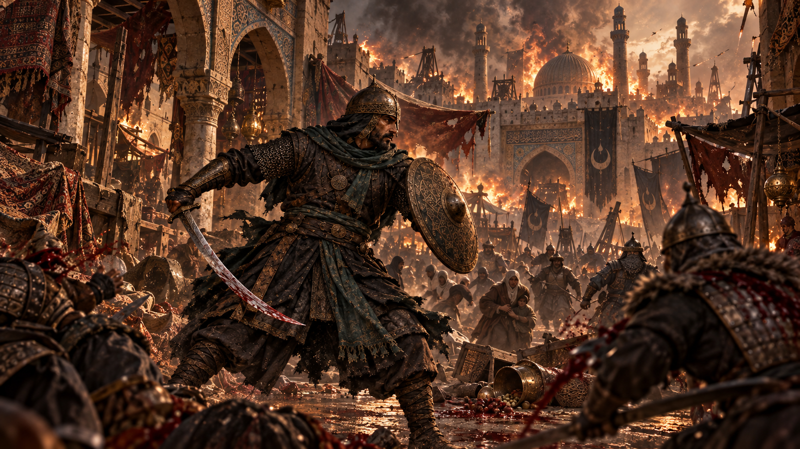

# The Last Abbasid
### آخر العباسيين

**A dark, hand-built 2D pixel-art action platformer set during the Mongol sack of Baghdad, February 1258.**


-555)


</div>

> [!WARNING]
> **Content warning.** The game depicts the massacre of a city: graphic sword combat with dismemberment and heavy blood, executions of civilians, the dead in the streets, and the burning of books. It is shown as the horror it was, never as spectacle. Children are never harmed and there is no sexual violence. A **Gore** setting (Full / Reduced) is in *Settings*.

---

## Contents

- [The story](#the-story)
- [Screenshots](#screenshots)
- [Features](#features)
- [How it plays](#how-it-plays)
  - [Your moves](#your-moves)
  - [Learning on the road](#learning-on-the-road)
  - [Hulegu's army](#hulegus-army)
  - [Reading a blow](#reading-a-blow)
  - [Finishers](#finishers)
  - [The streets: stealth, executions and ambushes](#the-streets-stealth-executions-and-ambushes)
  - [Lamps, remedies, pages and saves](#lamps-remedies-pages-and-saves)
- [Controls](#controls)
- [Getting started](#getting-started)
- [Project structure](#project-structure)
- [Architecture](#architecture)
- [The art pipeline: 3D models rendered into pixel art](#the-art-pipeline-3d-models-rendered-into-pixel-art)
- [Sound and music](#sound-and-music)
- [Rebuilding the assets](#rebuilding-the-assets)
- [Testing](#testing)
- [Development rules](#development-rules)
- [Status and roadmap](#status-and-roadmap)
- [The history behind it](#the-history-behind-it)
- [Credits](#credits)
- [License](#license)

---

## The story

Baghdad, the City of Peace, seat of the Abbasid caliphs for five hundred years, falls to Hulegu Khan's army in February 1258. You are **Yusuf ibn Harun**, a guardsman of the Caliph whose company is gone. While the city burns you fight your way across it, not to win a war that is already lost, but to carry out what can still be carried out: its books, and its people.

The characters and events are fiction set amid real history (see [The history behind it](#the-history-behind-it)).

**Chapter I: The Fall of the City of Peace** is playable from the title screen to the ending across four levels and a boss:

| | Level | What happens there |
| --- | --- | --- |
| 1 | **The Fallen Market** | The Booksellers' Market at night. A man kneels under a sabre at the gate street, looters strip the stalls, soldiers burn books beneath a gallery. Find Ibrahim the bookseller, drive the soldiers from his door, and carry his manuscripts to the river gate. |
| 2 | **Streets of Ash** | Burning lanes blocked by fallen houses, archers on the rooftops, executions in the lanes and a little square where captives are roped together. Free them, among them a man in a saffron sash, and meet Hulegu's Georgian allies behind their tall shields. |
| 3 | **The Scholars' Quarter** | A college's tiled portal, its fountain, a library being torn apart and a river wall where the Tigris runs dark. Siege engineers lob burning naphtha. Save the keeper of the library and his catalogue. |
| 4 | **The Last Gate** | First light along the southern wall: past the Mongols' camp, up onto the rampart where mace-bearers hold the walk, down through the wreck of the siege to the gate square, where **Toqto Noyan, captain of a thousand**, holds the last gate. |

A story card carries you between levels, and the chapter ends with a tally of the lives you saved and the pages you rescued.

---

## Screenshots

<div align="center">

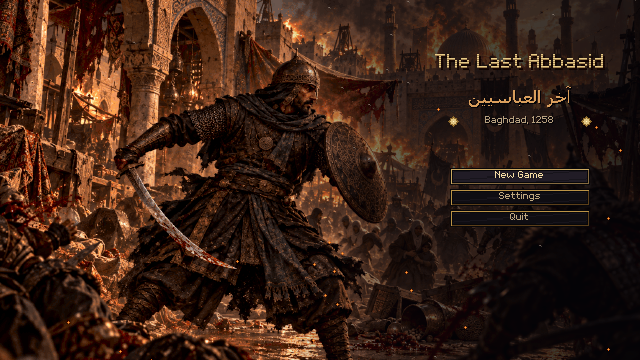 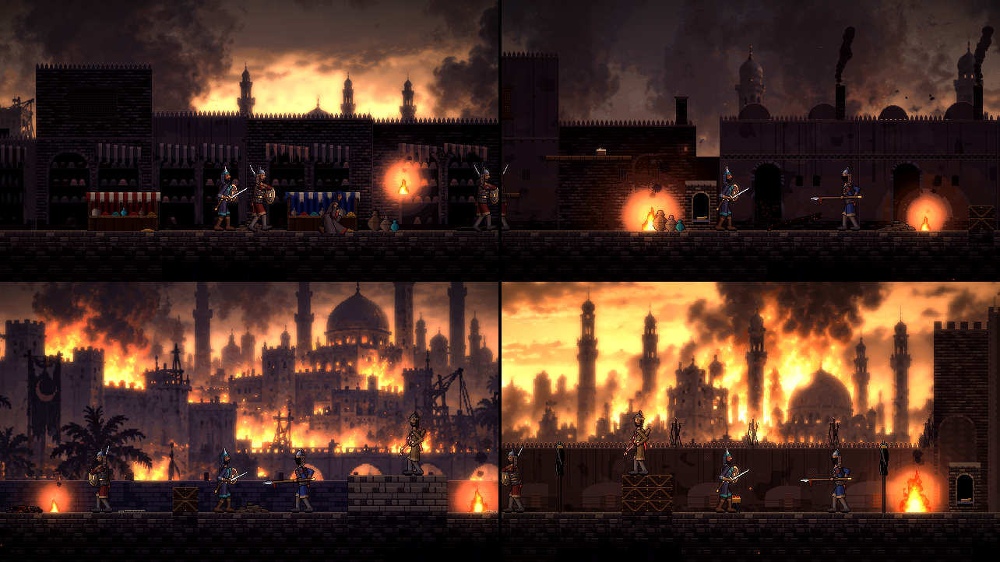

*The title screen, and the four levels of Chapter I (the distant cities are painted from the project's concept art).*

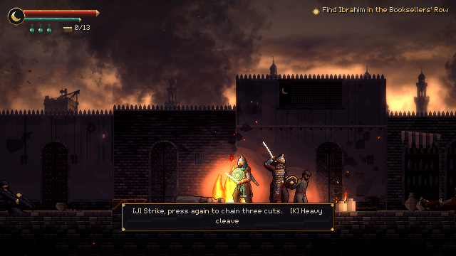 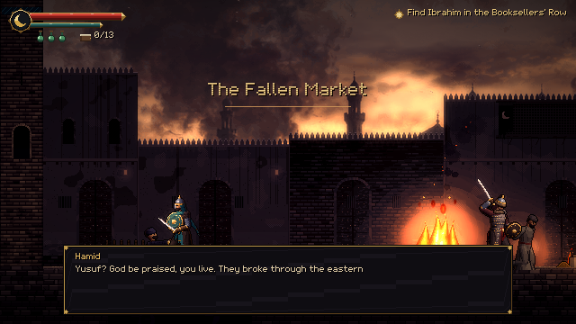

*Sword and shield in the Booksellers' Market; Hamid, a wounded guard, at the gate.*

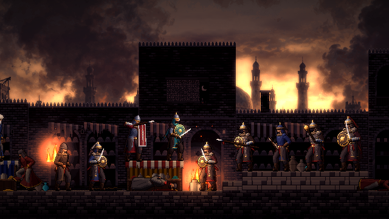

*The cast: a refugee, the siege engineer, the keshig veteran, the Georgian shield-bearer, Yusuf, the swordsman, the spearman, the archer, the mace-bearer and Toqto Noyan.*

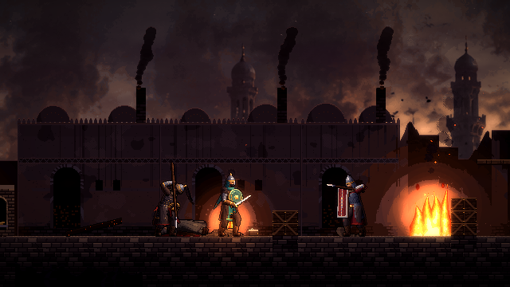 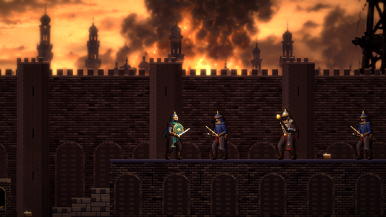 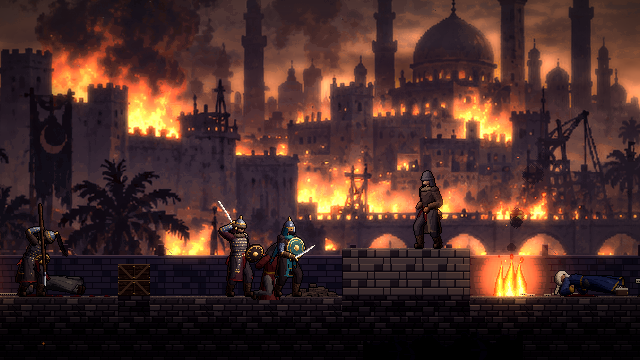

*A shield-bearer on the bathhouse street; a mace-bearer between archers on the rampart; an engineer covering an execution on the river wall.*

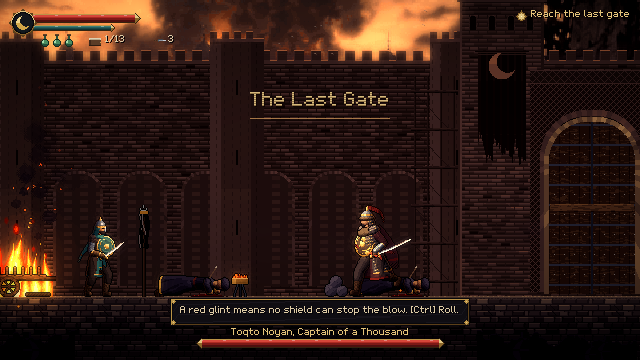 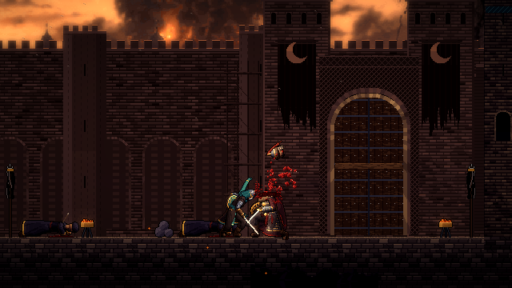

*Toqto Noyan at the last gate, and his end.*

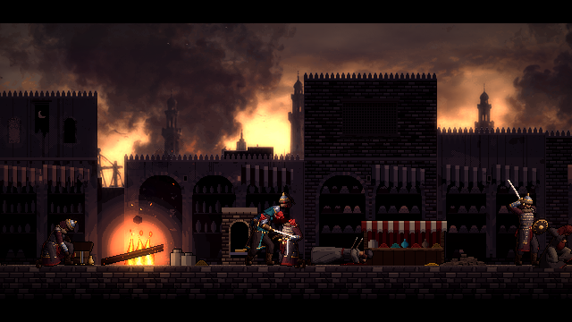 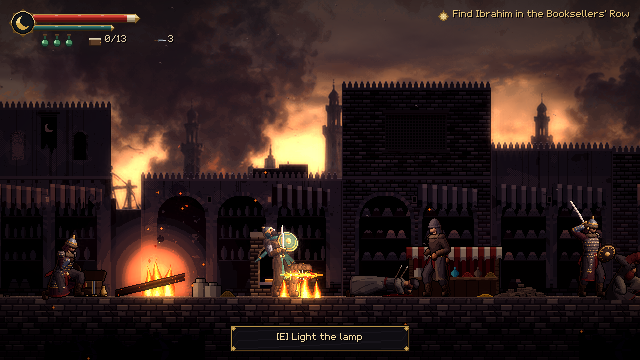

*A finisher on the last soldier standing; an engineer's fire pot bursting at Yusuf's feet.*

</div>

---

## Features

- **Combat built on reading and answering.** Every enemy blow glints before it lands, in white, amber or red, telling you whether to parry, jump or roll. Hits land with hit-stop, trauma shake, sparks and blood. A full move set: a three-cut combo, a guard-breaking cleave, a parry and riposte, a shield bash, a dodge roll and a rolling cut, an air slash, a plunging strike, throwing knives, and four scripted finishers.
- **Seven kinds of soldier and a two-phase boss**, each asking a different question: the swordsman's guard, the spearman's reach and low sweep, the archer's arrows, the keshig veteran's delayed second cut, the unflinching mace-bearer, the Georgian shield-bearer's wall, the siege engineer's fire, and Toqto Noyan.
- **Encounters that are designed, not scattered.** Soldiers are about their business when you find them: looting, burning books, stabbing at the dead, holding a sabre over a kneeling captive. A blow they never see coming kills them. Executions run on a clock you can beat or lose, and ambushes spring from behind.
- **A technique learned in each level.** Pages of a treatise on the arts of war teach the shield bash, the plunging strike and the rolling cut just before the soldiers who call for them, and a freed captive gives you knives.
- **A brutal, historical world.** Dismemberment with tumbling pieces, pumping wounds and pooling blood, all derived from the same 3D models as the bodies; refugees cut down as they run; the dead lying in the streets. A Gore setting tones it down.
- **Every picture and sound generated by code.** Characters are 3D models built, rigged and animated in Node.js and rendered into pixel art by the project's own rasterizer and shader. The distant cities are resampled from concept paintings, the nearer streets are painted procedurally in the same palette, and the effects, UI and fonts are drawn by script. The music is synthesized: an oud over a drone in a maqam for each place.
- **English and Arabic**, switchable in Settings.
- **Tested end to end.** Headless suites cover the hero, every soldier, finishers and the whole chapter played through the real session, and an autoplayer finishes all four levels with real physics.

---

## How it plays

### Your moves

<div align="center">
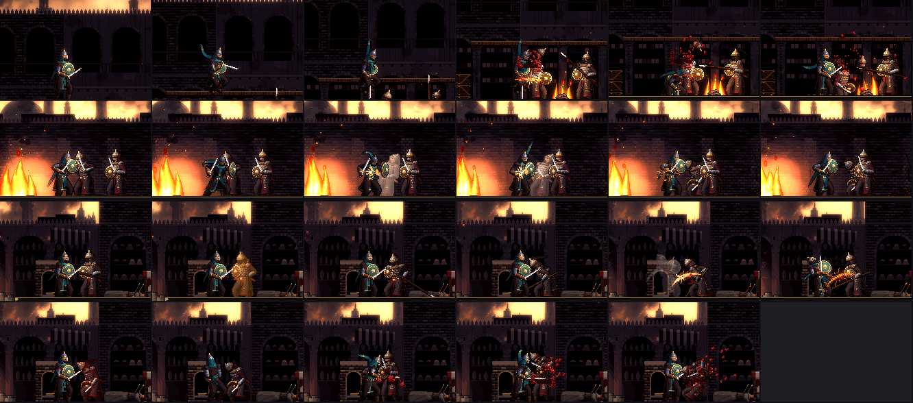

*Top to bottom: dropping through the gallery and plunging onto a book burner; the shield bash breaking a guard; a spearman's amber low sweep passing under the shield; a quick finisher while another soldier still fights.*
</div>

| Move | How | What it does |
| --- | --- | --- |
| **Light combo** | Attack, up to three times | A forehand cut, a rising backhand and a lunging thrust. The thrust's poise damage staggers most soldiers. |
| **Heavy cleave** | Heavy | A slow overhead blow that **breaks a raised guard**. |
| **Block / parry** | Hold Block | Blocks frontal blows for stamina. Raised just as a blow lands (a 0.17 s window), it **parries**: the soldier staggers and your next blow is a **riposte** at 1.8× damage. |
| **Shield bash** | Hold Block + Heavy | Fast and cheap. Breaks any raised guard, even a shield-bearer's wall, and shoves a man back. |
| **Dodge roll** | Dodge | Invulnerable for most of its length. You roll **through** soldiers. |
| **Rolling cut** | Attack late in a roll | Up out of the roll in a rising cut, turned on the man you rolled past. Attack again for the thrust. |
| **Air slash** | Attack in the air | Two per jump, each checking your fall a moment. |
| **Plunging strike** | Heavy in the air | The blade turned point-down; you drop on the man below and land on it. Breaks guards and shield walls; kills a man who never saw it. |
| **Drop through planks** | Down + Jump on a plank | Drop from a gallery onto whoever is below. |
| **Throwing knife** | Throw | Fast and flat. Three, refilled at lamps. A raised shield turns them. |
| **Finisher** | Heavy, on a staggered soldier glowing red | One of four scripted kills ([below](#finishers)). |
| **Remedy** | Heal | Drinks a remedy (+45 health). Three, refilled at lamps. |

Stamina pays for attacks, blocks and rolls and recovers when you pause. Run dry and your guard breaks.

### Learning on the road

You start with the cuts, the cleave, the shield, the roll, the air slash and the drop through planks. The rest is learned in the story, each just before it is needed:

| Where | What | From |
| --- | --- | --- |
| Streets of Ash | **Shield bash** | A page of a treatise on arms, by the bathhouse, before the first shield-bearer |
| Streets of Ash | **Throwing knives** | Salim, freed with the captives at the square |
| The Scholars' Quarter | **Plunging strike** | A page on the library's gallery, above the soldiers at their work |
| The Last Gate | **Rolling cut** | A page by the camp lamp, before the mace-bearers |

### Hulegu's army

<div align="center">
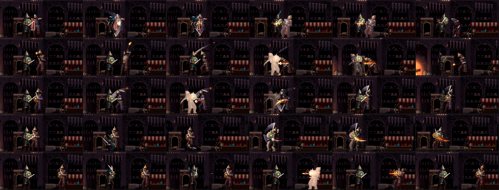

*The shield wall turning a cut, then broken by the bash; the mace-bearer's overhead blow; the keshig veteran's two cuts; the rolling cut through a soldier; a throwing knife.*
</div>

| Soldier | How he fights | How to beat him |
| --- | --- | --- |
| **Swordsman** | Closes to sword's length; a quick cut and an armoured rising slash; raises his guard against combos. | Parry and riposte, or break his guard with the cleave or the bash. |
| **Spearman** | Keeps you at spear's length; a long thrust, and a **low sweep** (amber) when you slip inside. | Get past the point; jump or roll the sweep, which no shield stops. |
| **Archer** | Keeps his distance and shoots from rooftops and wagons; flees when his comrades fall. | A raised shield stops arrows; close in, or throw a knife. |
| **Keshig veteran** | A guardsman of the khan, masked, white-plumed. His quick cut is often followed by a backhand after a held beat. | Don't parry in a panic: the second cut comes late. |
| **Mace-bearer** | Armoured to the collar. Light blows wound him but **do not stop him**; his overhead blow **breaks a raised shield**. | Parry it or roll through, and punish his long recovery from behind. |
| **Georgian shield-bearer** | Hulegu's Christian allies, in mail behind a tall crimson shield. The shield turns **every blow from the front**, the cleave and knives too. He jabs over its rim and shoves. He turns slowly. | The **shield bash** or a **plunge** breaks the wall; or roll behind him. Parry his shove to open him. |
| **Siege engineer** | Keeps his distance and lobs pots of burning naphtha at where you are going. They leave fire on the ground. | Keep moving: **no shield keeps out the fire**. Close fast or plunge from above. |
| **Toqto Noyan** | Captain of a thousand, behind a gold-worked shield. A chained three-cut combo, a leaping smash no shield stops, a shield charge no parry turns. Below half his strength he roars into a faster second phase. | Read the red glints and roll; ripostes and broken poise stagger him. |

All soldiers obey fairness rules (tested): every blow is telegraphed, at most two swing at once, and none starts an attack on you while you are invulnerable or just after you were hit.

### Reading a blow

Each enemy attack winds up with a **glint** on the weapon at least **0.22 seconds** before it lands:

| Glint | Meaning | Answer |
| --- | --- | --- |
| ⚪ **White** | An ordinary blow | Block it, or parry it as it lands |
| 🟠 **Amber** (the soldier flushes amber) | A low sweep at the legs: no standing guard stops it | **Jump** over it or roll |
| 🔴 **Red** (the soldier flushes red) | Nothing stops it (the Captain's smash, his charge) | **Roll** |

### Finishers

<div align="center">
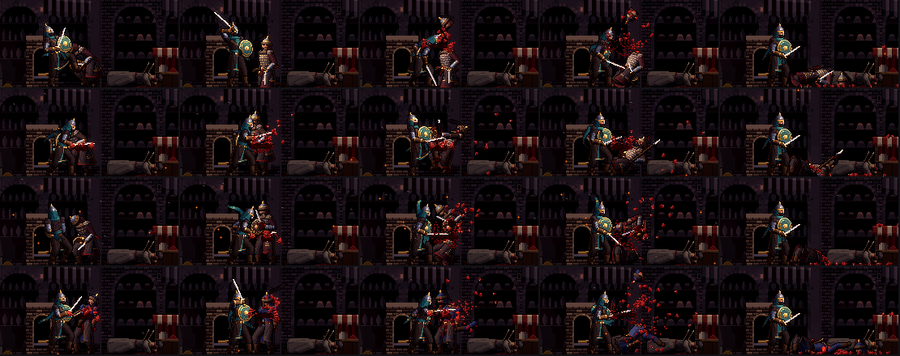

*Headsman, Run Through, Spin Cleave and Disarm.*
</div>

A soldier who is **staggered** (by a parry, a broken guard, broken poise or the bash) and **wounded to half his strength or less** glows red, and the prompt reads *Finish him*. Press Heavy and Yusuf plays one of four scripted kills, frame-locked with the soldier's own animation: **Headsman** (a kick to the knees, then the head), **Run Through** (lifted on the blade, kicked off it), **Spin Cleave** (a full turn through the waist) and **Disarm** (the sword arm, then the head). You are untouchable while it plays, and it gives back stamina. The last soldier standing gets the full treatment (black bars, a sting and slow time); while others are still fighting it plays quicker. The Captain has an ending of his own.

### The streets: stealth, executions and ambushes

- **Soldiers at their business** see half as far and hear a quarter as well. Strike one who has not noticed you and he dies of the blow; one who hears you behind him is startled for a moment before he turns.
- **The alarm:** a soldier who notices you shouts, and comrades within earshot join the fight.
- **Executions:** once you are near enough to see a captive kneeling under a sabre, a count begins. Reach the headsman in time and the captive runs free with thanks; arrive too late and Yusuf knows it. The chapter counts the lives you saved.
- **Ambushes** spring from ahead and behind, and a sprung ambusher follows you however far you run.
- **People** can always be spoken to, though some will only ask for help until their captors are dead.

### Lamps, remedies, pages and saves

- **Lamps** in prayer niches are checkpoints: lighting one saves, heals you and refills your remedies and knives. Fall, and you return to the last lamp, and so do the soldiers.
- **Manuscripts:** thirteen pages and codices to rescue from the fires, readable in full (three of them pages of the treatise that teach techniques). You keep them even if you fall.
- **Continue** resumes at the last lamp of the level you reached.

---

## Controls

| Action | Keyboard | Mouse | Gamepad |
| --- | --- | --- | --- |
| Move (tilt the stick lightly to walk) | A / D or ← / → | | Left stick / D-pad |
| Jump (hold for higher) | Space | | A |
| Drop through planks | S / ↓ + Space | | Stick ↓ / D-pad ↓ + A |
| Light attack · in the air, a slash | J | Left button | X |
| Heavy cleave · in the air, the plunge · on a glowing soldier, a finisher | K or F | Middle button | Y / RT |
| Block (hold) / parry (raise as the blow lands) | L | Right button | RB |
| Shield bash | L held + K | Right + middle button | RB held + Y |
| Dodge roll · then attack for the rolling cut | Ctrl or C | | B |
| Throw a knife | U | | LT |
| Interact / talk / light a lamp | E, W or ↑ | | D-pad ↑ |
| Drink a remedy | Q | | LB |
| Pause | Esc | | Start |

Menus take arrows/WASD, Enter/Space and Esc, or the D-pad, A and B. On-screen hints show the button for whichever device you last touched.

---

## Getting started

### Requirements

- **[Godot 4.7.2](https://godotengine.org/)** (standard build; .NET is not needed). The project uses the Compatibility renderer (OpenGL 3.3), so any reasonably recent GPU works.
- **[Node.js](https://nodejs.org/) 20 or newer**, only for the test runner and the asset generators. No npm packages are needed. Godot alone runs the game.

### Run the game

1. Clone the repository:
   ```bash
   git clone https://github.com/shehab20089/the-last-abbasid-v2.git
   ```
2. Open `project.godot` in Godot 4.7.2 (*Import* in the project manager). The first import takes a moment.
3. Press **F5**.

Or from a terminal in the project folder:

```bash
godot --path .
```

(Use the full path to your Godot executable if it is not on your `PATH`.)

The game renders at **640×360** and scales by whole multiples: a 1280×720 window by default, fullscreen in Settings. Saves and settings live in Godot's user data folder; on Windows that is `%APPDATA%\Godot\app_userdata\The Last Abbasid\`.

---

## Project structure

```
the-last-abbasid/
├── app/                 the session: main.tscn (generated) + main.gd (AbbasidGame)
├── features/
│   ├── combat/          Combatant, HitData, AttackDefinition, FinisherDefinition, hitboxes, hit-flash shader
│   ├── warrior/         the hero: state machine, input, animator, profile and attack definitions
│   ├── enemies/         MongolSoldier (the body), EnemyBrain and one brain per kind, profiles,
│   │                    attacks, arrows, fire pots and burning ground
│   ├── levels/          Level, lamps, manuscripts, people, captives, triggers, the exit, the boss
│   │                    arena, and the four generated level scenes
│   ├── presentation/    camera (look-ahead, trauma shake), hit-stop, post-process shader
│   ├── story/           DialogueLibrary (who says what; the words live in the strings table)
│   ├── ui/, menu/       HUD, dialogue box, input glyphs; title, pause, settings, story card, reader
├── shared/              sound, music and VFX directors, the gore director, SaveGame, GameSettings
├── assets/              generated art, audio, fonts and the English/Arabic strings table
├── tools/
│   ├── asset_generation/  the 3D-to-pixel pipeline, environments, effects, UI, fonts, audio
│   ├── levels/            each level as data (<level>.mjs) and the scene builder
│   ├── run_godot_cli.mjs  runs Godot headless, fails on script errors, times out
│   └── run_tests.ps1      imports the project and runs every suite
├── tests/               gameplay, enemy, session and traversal suites; capture scripts; fixtures
└── docs/                art style guide, concept art, README media
```

Further reading: [`AGENTS.md`](AGENTS.md) (the technical briefing), [`PROGRESS.md`](PROGRESS.md) (what has been built and what comes next) and [`docs/art_style_guide.md`](docs/art_style_guide.md).

---

## Architecture

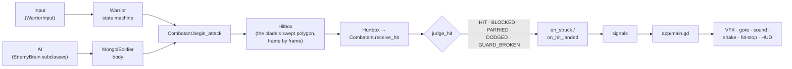

- **Controllers drive bodies.** `WarriorInput` drives the `Warrior`; an `EnemyBrain` subclass drives each `MongolSoldier`. Bodies carry the rules (health, poise, guarding, staggers); brains only decide.
- **Data in read-only resources.** `WarriorProfile`, `EnemyProfile`, `AttackDefinition` and `FinisherDefinition` hold the tuning; mutable state belongs to the actor.
- **Animation-driven timing.** An attack's active, recovery and telegraph frames index its animation strip, and the hitbox on each active frame is the blade's swept polygon, generated with the sprites.
- **Gameplay never depends on presentation.** Effects, gore, sound and the HUD are wired in `app/main.gd` from signals; the directors know no gameplay types.
- **The story is data.** Each level's terrain, props, soldiers and their activities, people, captives, triggers, objectives, exit and boss arena are a JavaScript file in `tools/levels/`, built into a scene. `main.gd` holds no level-specific story.
- **Typed GDScript everywhere.** The project turns untyped declarations and unsafe access into errors.

---

## The art pipeline: 3D models rendered into pixel art

<div align="center">
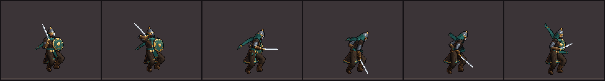
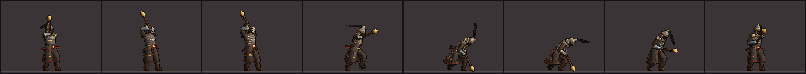

*Yusuf's air slash and the mace-bearer's overhead blow, as the pipeline renders them (enlarged 2×).*
</div>

There is no hand-drawn sprite and no Blender file in the project. Every character is a 3D model written in JavaScript and turned into pixel art by the project's own renderer (`tools/asset_generation/`):

1. **Meshes** (`lib/meshes.mjs`): lofted tubes, ellipsoids, lathes, round and tall shields, ribbons. A model (`characters/yusuf.mjs`, `mongol3d.mjs`, `townsfolk3d.mjs`) assembles them into parts with materials.
2. **A skeleton** (`characters/body3d.mjs`): hips, a twisting torso, a head, two-bone IK for legs and arms, a centre-gripped shield and the blade's direction. Parts are skinned to it, and cloth (scarves, plumes, cloaks, sashes) is simulated as chains through each animation.
3. **Poses, keyed by hand** (`*_animations.mjs`): anticipation, a strike on one or two frames, follow-through and a settle back to guard. Planted feet stay planted while a lunge carries the body (`lib/root_motion.mjs`).
4. **A rasterizer** (`lib/raster.mjs`) renders a G-buffer at four samples a pixel from a camera turned 22° to a three-quarter view.
5. **A pixel shader** (`lib/sprite_shader.mjs`) reduces it to pixel art: majority downsampling, palette ramps by light, separation lines, a warm firelit rim on the back edge and an outline. Blades are drawn as clean two-pixel lines, and their hilt and tip positions are exported for the hitboxes and the runtime sword trails.
6. **Gore** comes from the same models: each cut (head, arm, leg, waist) hides what was severed, shows a wound cap, and renders the severed piece tumbling through eight turns.

`node tools/animation_lint.mjs` checks every animation for pops, foot sliding, loop seams and limbs asked to reach too far. The rules of light, value, colour and silhouette are in [`docs/art_style_guide.md`](docs/art_style_guide.md).

**Environments:** each level's distant city is resampled from one of the concept paintings in `docs/concept_art/` and reduced to the game's palette. The streets before it (facades, stalls, towers, banners with the gold crescent, lattice balconies, cranes and hanging cages, cobalt tilework) are painted procedurally in that palette, kept lower and darker so the burning city shows above. Fires spit embers, smoke drifts, and a post-process adds bloom, split toning and a vignette.

---

## Sound and music

Every sound is synthesized by `tools/asset_generation/audio/build_sounds.mjs`: sword swings and hits, shield blocks, parries, the sever of a limb, a pot of naphtha bursting, ambiences of wind and fire. The score is a plucked oud over a drone, with a frame drum and a ney, in a maqam for each place: **Hijaz** for the market, **Saba** for the burning streets, **Bayati** for the scholars, and **Hijaz Kar** for the last gate and its captain.

---

## Rebuilding the assets

Everything in `assets/` (and the level scenes and `app/main.tscn`) is generated and deterministic: rerunning a generator rewrites identical files. Edit the generators or the level data, never the generated files.

```bash
node tools/asset_generation/build_characters.mjs                        # hero, soldiers, captain, townspeople (--only <name>)
node tools/asset_generation/build_environment.mjs --shared              # the shared tileset and props
node tools/asset_generation/build_environment.mjs --level streets_of_ash  # one level's sky, city, river, backdrop, facades
node tools/asset_generation/build_effects.mjs                           # sparks, blood, dust, fire, smoke, light, projectiles
node tools/asset_generation/build_ui.mjs                                # panels, bars, icons, the app icon
node tools/asset_generation/build_font.mjs                              # the pixel fonts
node tools/asset_generation/audio/build_sounds.mjs                      # effects, ambiences and music
node tools/levels/build_level.mjs streets_of_ash                        # assemble a level scene from its data
node tools/write_main_scene.mjs                                         # wire every sound and track into app/main.tscn
```

The levels are `fallen_market`, `streets_of_ash`, `scholars_quarter` and `last_gate`. Review sheets of the art are written to `captures/art_review/` (enlarged 4×).

---

## Testing

```powershell
./tools/run_tests.ps1
```

The runner imports the project, then runs the headless suites with fixed 1/60 s frames, so timings are identical on any machine:

| Suite | Checks | What it proves |
| --- | --- | --- |
| `tests/gameplay_test.gd` | 86 | Movement, jumps and coyote time, the combo, cleave, block, parry and riposte, roll, hurt, heal and death; the air slash, the plunge, dropping through planks, the rolling cut, knives; real keyboard and gamepad input |
| `tests/enemy_test.gd` | 179 | Every soldier's behaviour and attacks; surprise kills, dismemberment, executions, the alarm; finishers and their rules; that every blow glints at least 0.22 s ahead; the low sweep, the slow guard, the shield wall, the mace-bearer, the fire pots; the Captain's phases |
| `tests/session_test.gd` | 79 | The chapter played through the real session: dialogue, lamps, pages, death and return, rescues, ambushes, learning a technique from a page, saving and loading, the boss and the ending |
| `tests/traversal_test.gd` | 4 levels | An autoplayer that finishes every level with real physics, fighting every soldier it meets |

Godot's path comes from the `GODOT_PATH` environment variable (or the `-GodotPath` parameter). `./tools/run_tests.ps1 -Visual` also renders review screenshots, and `tests/capture_*.gd` render encounters, finishers, moves, soldiers, the cast and a tour of every level into `captures/` (these need a window).

---

## Development rules

- **Typed GDScript** with unsafe access treated as an error; read `Variant` values into typed variables before use.
- **Feature folders**; shared presentation in `shared/`; the session in `app/`. No global event bus, no autoloads unless truly needed.
- **Generated files are generated:** change the generator or the level data, then rebuild.
- **Fairness is tested:** every enemy attack telegraphs in time, at most two soldiers attack at once, nobody attacks a hero who was just hit, the hero's post-hit invulnerability outlasts his stagger, and soldiers never walk off ledges.
- **Art follows the style guide** and is reviewed as images (`captures/`) before it is called done.

---

## Status and roadmap

**Chapter I is complete**: four levels and the Captain, every system above, verified by the automated suites and rendered captures. It has not yet had extended human playtesting, so difficulty, combat feel and the audio mix are the next things to tune.

Next:

- Playtest-driven tuning: soldier aggression, the new soldiers' difficulty, the engineers' aim, finisher reach and length.
- The gate square's backdrop and other art polish (see [`PROGRESS.md`](PROGRESS.md)).
- Release work: export presets and builds, input rebinding, a pixel Arabic font, performance and audio passes.
- Chapter II.

---

## The history behind it

In February 1258 the Mongol army of **Hulegu Khan** took Baghdad after a short siege. The last Abbasid caliph, **al-Musta'sim**, was put to death, and with him ended the caliphate that had ruled from Baghdad for five centuries. The city's people were massacred over days; contemporary accounts put the dead in the tens or hundreds of thousands. Its libraries, among them the collections of the House of Wisdom, were destroyed, and a famous account says the Tigris ran black with the ink of the books thrown into it.

Hulegu's army was not only Mongol: it included Persian and Turkic troops, siege engineers (many of them Chinese) who served the catapults, and Christian allies such as the **Georgians**. The treatise pages Yusuf finds draw on the real Arabic literature of *furusiyya*, the arts of horsemanship and arms.

Yusuf, his companions and the events of the game are fiction. The game takes care to show the people of Baghdad with dignity and the violence as what it was.

---

## Credits

- **Created by** [shehab20089](https://github.com/shehab20089), who also set the art direction with the concept paintings in [`docs/concept_art/`](docs/concept_art/).
- **Developed with** [Claude Code](https://claude.com/claude-code).
- **Engine:** [Godot](https://godotengine.org/).
- **Inspirations:** the atmosphere of *Blasphemous*, the combat feel of *Dead Cells* and the movement of *Prince of Persia*. Their qualities, never their art.

All characters, animation, environments, effects, fonts, sound and music in this repository are original and generated by its own scripts.

---

## License

No license has been chosen yet, so all rights are reserved by the author. Please ask before reusing the code, art or music.
