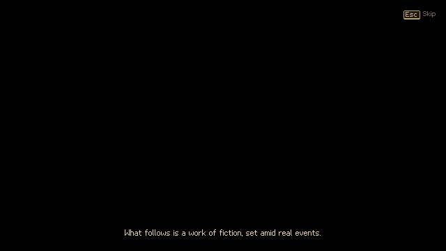
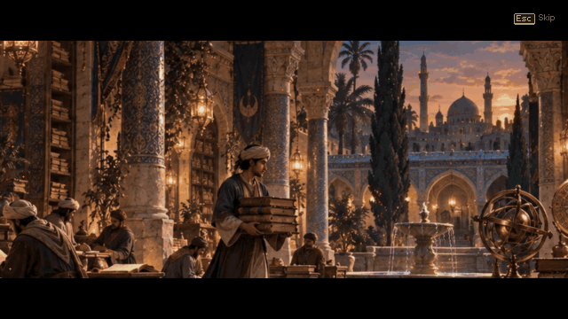
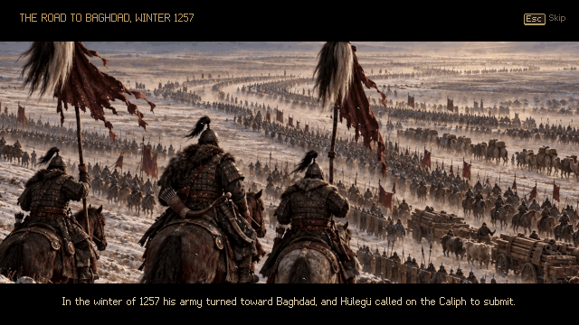
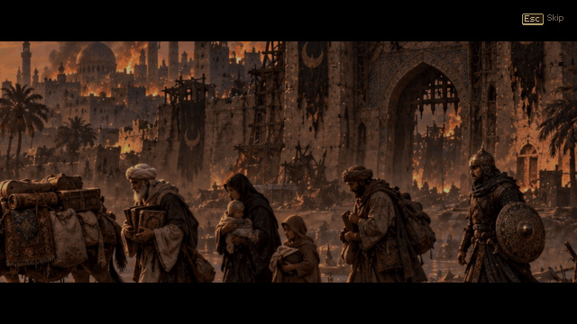
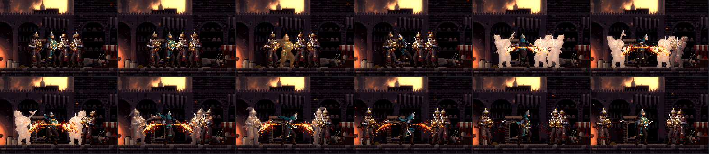
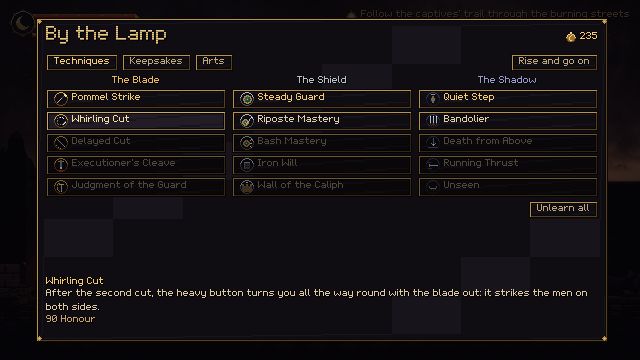
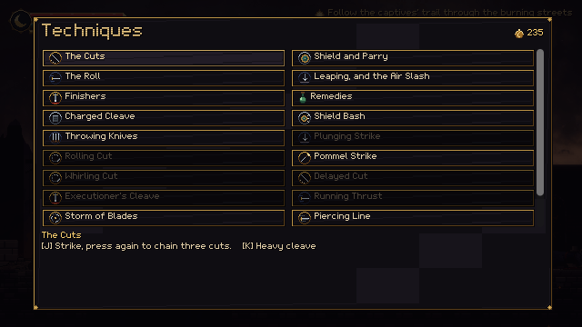
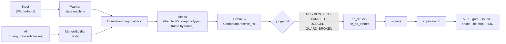

<div align="center">


# The Last Abbasid
### آخر العباسيين

**A dark, hand-built 2D pixel-art action platformer set during the Mongol sack of Baghdad, February 1258.**


-555)


</div>

> [!WARNING]
> **Content warning.** The game depicts the massacre of a city: graphic sword combat with dismemberment and heavy blood, executions of civilians, the dead in the streets, and the burning of books. It is shown as the horror it was, never as spectacle. Children are never harmed and there is no sexual violence. A **Gore** setting (Full / Reduced) is in *Settings*.

---

## Contents

- [The story](#the-story)
- [Screenshots](#screenshots)
- [Features](#features)
- [How it plays](#how-it-plays)
  - [Your moves](#your-moves)
  - [Growing stronger](#growing-stronger)
  - [Hulegu's army](#hulegus-army)
  - [Reading a blow](#reading-a-blow)
  - [Finishers](#finishers)
  - [The streets: stealth, executions and ambushes](#the-streets-stealth-executions-and-ambushes)
  - [Lamps, remedies, pages and saves](#lamps-remedies-pages-and-saves)
- [Controls](#controls)
- [Getting started](#getting-started)
- [Project structure](#project-structure)
- [Architecture](#architecture)
- [The art pipeline: 3D models rendered into pixel art](#the-art-pipeline-3d-models-rendered-into-pixel-art)
- [Sound and music](#sound-and-music)
- [Rebuilding the assets](#rebuilding-the-assets)
- [Testing](#testing)
- [Development rules](#development-rules)
- [Status and roadmap](#status-and-roadmap)
- [The history behind it](#the-history-behind-it)
- [Credits](#credits)
- [License](#license)

---

## The story

Baghdad, the City of Peace, seat of the Abbasid caliphs for five hundred years, falls to Hulegu Khan's army in February 1258. You are **Yusuf ibn Harun**, a guardsman of the Caliph whose company is gone. While the city burns you fight your way across it, not to win a war that is already lost, but to carry out what can still be carried out: its books, and its people.

The characters and events are fiction set amid real history (see [The history behind it](#the-history-behind-it)).

**Chapter I: The Fall of the City of Peace** is playable from the title screen to the ending across four levels and a boss:

| | Level | What happens there |
| --- | --- | --- |
| 1 | **The Fallen Market** | The Booksellers' Market at night. A man kneels under a sabre at the gate street, looters strip the stalls, soldiers burn books beneath a gallery. Find Ibrahim the bookseller, drive the soldiers from his door, and carry his manuscripts to the river gate. |
| 2 | **Streets of Ash** | Burning lanes blocked by fallen houses, archers on the rooftops, executions in the lanes and a little square where captives are roped together. Free them, among them a man in a saffron sash, and meet Hulegu's Georgian allies behind their tall shields. |
| 3 | **The Scholars' Quarter** | A college's tiled portal, its fountain, a library being torn apart and a river wall where the Tigris runs dark. Siege engineers lob burning naphtha. Save the keeper of the library and his catalogue. |
| 4 | **The Last Gate** | First light along the southern wall: past the Mongols' camp, up onto the rampart where mace-bearers hold the walk, down through the wreck of the siege to the gate square, where **Toqto Noyan, captain of a thousand**, holds the last gate. |

The chapter opens on a **painted cinematic** that tells the world of 1258 without a narrator: the City of Peace before the war, its libraries, an ink map on which the Mongol advance spreads from the east and Hülegü's road draws itself to Hamadan, the army in the snow, the siege, the fall, and Yusuf on the wall. Between the levels and at the end the story goes on the same way (the river running black with ink, the library burning, the column of survivors at sunrise), and the chapter ends with a tally of the lives you saved and the pages you rescued.

---

## Screenshots

<div align="center">

 

*The title screen, and the four levels of Chapter I (the distant cities are painted from the project's concept art).*

 

 

*The cinematics: the City of Peace before the war, the ink map of Hülegü's road, the siege, and the column of survivors at dawn.*

 

*Sword and shield in the Booksellers' Market; Hamid, a wounded guard, at the gate.*


*The cast: a refugee, the siege engineer, the Kipchak skirmisher, the keshig veteran, the Georgian shield-bearer, Yusuf, the swordsman, the spearman, the archer, the Georgian axeman, the mace-bearer and Toqto Noyan.*

  

*A shield-bearer on the bathhouse street; a mace-bearer between archers on the rampart; an engineer covering an execution on the river wall.*

 

*Toqto Noyan at the last gate, and his end.*

 

*A finisher on the last soldier standing; an engineer's fire pot bursting at Yusuf's feet.*

</div>

---

## Features

- **Combat built on reading and answering.** Every enemy blow glints before it lands, in white, amber, violet or red, telling you whether to block, jump, parry or roll. Hits land with hit-stop, a camera kick, sparks and blood; great blows **throw men off their feet**, and a man down can be finished where he lies. **Breath** pays for everything and is earned back by fighting well: blows that land, parries, a guard raised in the glint at a blow's end (**Steady Breath**) and a roll timed to the last instant (a **Close Call**: time slows and your next blow is a counter). A deep move set: a light string of three cuts and a **kick** that branches into an **ender** on the heavy button at each step (a pommel strike, a whirling cut all round, an executioner's cleave), a **heavy string** of three (the cleave, a rising cleave, a windmill of the blade), a **low cut** under a raised shield and a **reaping sweep** that floors every man about you, a **guarded thrust** from behind the shield, a **riposte** of its own, a **running slash**, a **down-stab** that springs you off whatever it strikes, a **delayed cut** that catches a guard as it drops, a guard-breaking cleave you can **hold to charge** in three levels, a **running thrust**, a parry and riposte, a shield bash, a dodge roll and a rolling cut, an air slash, a plunging strike, throwing knives, and four scripted finishers. The newer moves are taught two a level, each just before the soldiers who call for it.
- **Resolve and five Arts.** Fighting well (parries, finishers, landed blows) fills a meter that being struck drains. Spend it on great techniques on their own button: the **Storm of Blades**, the **Piercing Line**, the **Naft Flask**, the **Second Wind** and the **Judgment of the Guard**.
- **A guardsman who grows the way you choose.** **Honour**, earned by saving captives, rescuing pages, finding the tokens of fallen guardsmen and fighting well, buys techniques at the lamps from a tree of fifteen in three branches (Blade, Shield, Shadow), unlearned for free. **Eight keepsakes**, most given by the people you save, change how you fight. Soldiers grow tougher level by level and learn to answer the new moves, so the stronger hero still meets resistance.
- **Nine kinds of soldier and a two-phase boss**, each asking a different question, and fighting with more than one move: the swordsman's guard, feint and chained cut, the spearman's reach, running lunge and low sweep, the archer's arrows and kick, the keshig veteran's delayed second cut and his parry, the unflinching mace-bearer, the Georgian shield-bearer's wall, the siege engineer's fire, the **Kipchak skirmisher** who dashes in and leaps clear of heavy blows, the **Georgian axeman** who hooks your shield aside and drags you in, and Toqto Noyan.
- **Encounters that are designed, not scattered.** Soldiers are about their business when you find them: looting, burning books, stabbing at the dead, holding a sabre over a kneeling captive. A blow they never see coming kills them. Executions run on a clock you can beat or lose, and ambushes spring from behind.
- **Every move has a job.** Each technique arrives just before the soldiers who call for it (a page of a treatise on the arts of war, a lesson on the way, Hamid, a freed captive, a dead engineer), and each answers a situation no other move does. The moves whose work others already do are the **master's techniques**: finishing Chapter I opens them for every later journey.
- **A brutal, historical world.** Dismemberment with tumbling pieces, pumping wounds and pooling blood, all derived from the same 3D models as the bodies; refugees cut down as they run; the dead lying in the streets. A Gore setting tones it down.
- **Every picture and sound generated by code.** Characters are 3D models built, rigged and animated in Node.js and rendered into pixel art by the project's own rasterizer and shader. The distant cities are resampled from concept paintings, the nearer streets are painted procedurally in the same palette, and the effects, UI and fonts are drawn by script. The music is synthesized: an oud over a drone in a maqam for each place.
- **Never lost, taught where you look.** A speech sign hangs over everyone with something to say (gold over the one your objective needs), their name and the button to speak over them as you come near; they call to you as you approach. The objective is marked over its target, or by an arrow at the screen's edge with how far it is, and every change is announced. Unlit lamps glow and carry their sign from afar. Lessons wait their turn on a card at the top of the screen, timed to be read, never lost; a new technique, the first lamp and the first warning of each colour stop the game on a card that shows the move performed; every lesson is kept in the pause menu's **Guide**, beside a **Journal** (the objective, the people met, what is left to find on this street) and a **Codex** of the pages you rescued. Buttons are drawn as keys, for whichever keyboard or pad you hold.
- **A playtest log.** Every play session writes what happened (each blow chosen and taken, how each warning was answered, falls and what caused them, kills, Arts, lamps, time on each street) to a log and a readable summary in the game's data folder (on Windows `%APPDATA%\Godot\app_userdata\The Last Abbasid\playlogs`). It never leaves the computer and can be switched off in Settings.
- **Settings for the player you are**: every action rebindable (keyboard and pad), lessons full, short or off, window size, vsync and brightness, screen shake, flashes, hit-stop and slow motion, and warning colours for colour-blind eyes.
- **Cinematics painted in motion.** The story between the levels is told in letterboxed shots of concept paintings, cut into depths that drift apart as a slow camera moves, with fire that breathes, water that ripples, banners that stir, smoke, embers, snow and birds, stones that strike the walls, and a map drawn in ink before your eyes; every frame is mapped to the shot's own palette, so it stays pixel art. One short line at a time, timed to be read in either language; Enter hurries it on, Esc skips it (at a press once seen).
- **English and Arabic**, switchable in Settings (the system's language at first), every screen laid out right to left in Arabic.
- **Tested end to end.** Headless suites cover the hero, every soldier, finishers and the whole chapter played through the real session, and an autoplayer finishes all four levels with real physics.

---

## How it plays

### Your moves

<div align="center">


*Top to bottom: dropping through the gallery and plunging onto a book burner; the shield bash breaking a guard; a spearman's amber low sweep passing under the shield; a quick finisher while another soldier still fights.*
</div>

| Move | How | What it does |
| --- | --- | --- |
| **Light string** | Attack, up to four times | A forehand cut, a rising backhand, a lunging thrust (its poise damage staggers most soldiers) and a **kick** that throws a man back: into a fire, off a ledge, out of a crowd. A light blow on a raised shield **glances off** and breaks the string: go under it, break it, or bash it. |
| **Low cut** | Down + Attack | A crouching cut at the shins that passes under a raised round shield (not a shield wall). Attack again for the rising backhand. |
| **Enders** *(master's)* | Heavy as a cut goes live | After the first cut, the **pommel strike** (knocks a guard aside; the cuts go on); after the second, the **whirling cut** (a full turn that strikes men on both sides and throws them back); after the thrust, the **executioner's cleave** (breaks any guard). |
| **Delayed cut** *(master's)* | Attack, attack, a beat, attack | A heavy cut that comes as a soldier lowers the shield he raised against your string. |
| **Heavy cleave** | Heavy | A slow overhead blow that **breaks a raised guard**. |
| **Heavy string** *(master's)* | Heavy, twice more | The **rising cleave**, ripped up out of the street (it sends a man reeling), then the **windmill**, a whole circle of the blade that strikes each time it passes and throws men down. |
| **Reaping sweep** | Down + Heavy | A whole turn at the shins that throws every man about you off his feet. Taught by a page in the Fallen Market. |
| **Charged cleave** | Hold Heavy | The blade held raised: at the second glint it breaks shield walls; at the third no guard stops it and the men beside him flinch. A blow or a roll breaks it off. Settings can make it a toggle (press to begin, press to strike). |
| **Running thrust** *(master's)* | Heavy on the run | The point driven forward in a 110 px dash that ends in the first man. |
| **Running slash** | Attack on the run | A leaping cut that closes the gap; the string carries on from it. |
| **Block / parry** | Hold Block | Blocks frontal blows for breath. Raised just as a blow lands (a 0.17 s window), it **parries**: the soldier is thrown open, you draw breath, and your next blow is a **riposte** at 1.8× damage. |
| **Steady Breath** | Block in the glint as your blow ends | Steel glints on Yusuf for an instant as each blow finishes; raise the shield in it and you draw breath (+20) and go straight into your guard. |
| **Close Call** | Dodge just as a blow comes | A roll in its first instant under a blow that would have landed: time slows, you draw breath (+20), and for a second your next blow is a counter. |
| **Shield bash** | Hold Block + Heavy | Fast and cheap. Breaks any raised guard, even a shield-bearer's wall, and shoves a man back. |
| **Guarded thrust** *(master's)* | Hold Block + Attack | A stab over the shield's rim with the shield still up. Fast and cheap; again and again. |
| **Riposte** | Attack after a parry or a close call | A lunge at the throat of the man you threw open. |
| **Dodge roll** | Dodge | Invulnerable for most of its length. You roll **through** soldiers. |
| **Rolling cut** | Attack late in a roll | Up out of the roll in a rising cut, turned on the man you rolled past. Attack again for the thrust. |
| **Air slash** | Attack in the air | Two per jump, a forehand and a backhand, each checking your fall a moment. |
| **Down-stab** *(master's)* | Down + Attack in the air | The point driven down beneath you; strike a man or his shield and you spring back up, ready to slash again. |
| **Plunging strike** | Heavy in the air | The blade turned point-down; you drop on the man below and land on it. Breaks guards and shield walls; kills a man who never saw it. |
| **Drop through planks** | Down + Jump on a plank | Drop from a gallery onto whoever is below. |
| **Throwing knife** | Throw | Fast and flat. Three, refilled at lamps. A raised shield turns them. |
| **Finisher** | Heavy, on a staggered soldier glowing pale blue | One of four scripted kills ([below](#finishers)). |
| **Ground stroke** | Heavy over a man thrown down | The blade driven down into him where he lies; wounded to half, it pins him for good. |
| **Remedy** | Heal | Drinks a remedy (+45 health). Three, refilled at lamps. |

**Breath** (the bar under your health) pays for attacks, blocks and rolls: a full string and a roll fit in one bar. It comes back quickly once you pause, and **every blow that lands gives some back** (more for heavier ones), as do parries, Steady Breath and close calls, so fighting well keeps you breathing while flailing leaves you winded: at zero you gasp and wait a moment, and an action you cannot pay for is refused. Run dry behind the shield and your guard breaks. The great blows (the charged cleave, the executioner's cleave, the plunge) **throw men down**; a heavy blow that does not makes them reel. The heaviest enemy blows (the mace-bearer's and the axeman's overheads, the Captain's smash) throw you down too: roll out of it, or get up untouched.

You do not have to remember any of this. A move you learn stops the game once to show itself, performed, with its buttons; then, when it can be made, its button and name float over Yusuf (*K Pommel Strike* as a cut lands, *Hold K* as the cleave rises, *I Storm of Blades* once the resolve is there), until you have used it three times; **Settings → Move Prompts** keeps them always or turns them off. The pause menu's **Techniques** page shows every move performed on a small stage while its buttons light up in order (for the keyboard or the gamepad, whichever you last touched), and the moves still ahead with where they come from. The lamp menu shows each technique the same way before you buy it, and a page of a treatise shows the move it teaches.

### Growing stronger

<div align="center">


*The Storm of Blades: two full turns among three soldiers, every man cut again and again.*

 

*By a lamp, the technique tree; in the pause menu, every move and where those still ahead come from.*
</div>

**The story teaches**, each just before it is needed:

| Where | What | From |
| --- | --- | --- |
| The Fallen Market | **Parry and riposte** | Hamid's counsel at the start, shown performed (the moves are yours from the first step) |
| The Fallen Market | **Reaping sweep** | A page of a treatise on arms, by the mosque lamp, before the ambush closes from both sides |
| The Fallen Market | **Low cut** | A lesson before the river gate's guards, who raise their shields to almost every blow |
| Streets of Ash | **Shield bash** | A page of a treatise on arms, by the bathhouse, before the first shield-bearer |
| Streets of Ash | **Running slash** | A lesson before the Kipchak skirmisher, who leaps clear of heavy blows but not of light ones |
| Streets of Ash | **Throwing knives** | Salim, freed with the captives at the square |
| Streets of Ash | **Resolve** and the **Storm of Blades** | A page past the square's lamp, before the captors spring |
| The Scholars' Quarter | **Plunging strike** | A page on the library's gallery, above the soldiers at their work |
| The Scholars' Quarter | **Kick** | A lesson past the library, before the engineers' fire: drive a man into it |
| The Scholars' Quarter | **Naft Flask** | The flasks of the first siege engineer you kill |
| The Scholars' Quarter | **Charged cleave** | A lesson past the axeman, before the second shield wall: it breaks a wall from a step away and a big man's poise |
| The Scholars' Quarter | **Piercing Line** | A page in the lecture hall, before the line of men at its end |
| The Last Gate | **Rolling cut** | A page by the camp lamp, before the mace-bearers |
| The Last Gate | **Second Wind** | Hamid, waiting at the camp |

**The master's techniques.** On a first journey the moves marked *(master's)* are closed: each does a job another move already does, and the first chapter is learned without them. Finish Chapter I and every later journey opens them: the Blade branch's four and the running thrust at the lamps, the rising cleave, the windmill, the guarded thrust and the down-stab taught on the way. They are the deeper layer of a replay.

**Resolve and the Arts.** The amber bar under your breath fills as you fight well: each blow that lands (more for heavier ones), a parry (15), a riposte, a finisher (20), a kill (more for one taken unawares or from above), a captive saved (25). Each blow you take costs 10, and out of the fight anything above half ebbs back to half. You carry two Arts, chosen at a lamp: the first on the **Art** button, the second on its own button or the Art button behind your shield. Spending one stops the world for a heartbeat: the street drains to ash grey around Yusuf and the Art's name crosses the screen in gold, its Arabic above it.

| Art | Resolve | What it does |
| --- | --- | --- |
| **Storm of Blades** | 50 | Three turns low with the blade out, steered as you go, every pass striking all round you and drawing men in; then a rising cut that throws them all down. Common soldiers caught in it die in it; nothing staggers you while you turn |
| **Piercing Line** | 50 | Drawn low, then across the street in a blink (about 200 px), through every man in the line; as you flick the blade clean, all their wounds open at once and throw them down. No blow touches you in it, and it breaks shield walls |
| **Naft Flask** | 50 | Greek fire: a fireball and a sheet of burning naphtha 150 px wide. Men caught are set ablaze and run burning (no blow, no guard), harmed as they go and setting alight the comrades they run into; no soldier walks into the fire. It burns you too |
| **Second Wind** | 100 | The guard's cry throws back and staggers every man near you (the Captain only gives ground); then ten seconds of fury: health and breath back, blows that cost nothing and come a quarter faster, light blows that do not stop you, a little blood back with every blow that lands, each kill holding the fury a second longer |
| **Judgment of the Guard** | 100 | Up to three men near you executed one after another, Yusuf crossing to each in a blink; a captain, or a hardened man still fresh, takes one great blow instead (40% of his strength, a fifth of the Captain's) |

**Honour** is earned, never looted: a captive saved from the headsman (30), someone freed from their captors (10), a page rescued (15, a treatise page 20), a fallen guardsman's token found (25, two hidden in each level), a soldier killed (4, more for a finisher, a surprise, a plunge, a riposte or an Art; once per man), a level left behind (40). It is kept when you fall. Spend it by the lamps on the **technique tree**; unlearning it all costs nothing:

| | The Blade | The Shield | The Shadow |
| --- | --- | --- | --- |
| 1 | Pommel Strike (60) | Steady Guard (60): blocking costs less | Quiet Step (60): busy soldiers hear you less |
| 2 | Whirling Cut (90) | Riposte Mastery (90): a wider parry, a harder riposte | Bandolier (90): two more knives |
| 3 | Delayed Cut (90) | Bash Mastery (90): a cheaper bash that staggers | Death from Above (90): a harder plunge that shakes men |
| 4 | Executioner's Cleave (140) | Iron Will (140): reel a third less long | Running Thrust (140) |
| 5 | Judgment of the Guard (200) | Wall of the Caliph (200): a parry restores, a third keepsake | Unseen (200): a surprise kill restores |

**Keepsakes**, most given by those you save, change how you fight while worn (two at once, three with the Wall of the Caliph): the mother's red thread (remedies heal more), Ibrahim's reed pen (pages give twice the Honour), Salim's saffron sash (another knife, and a knife that kills comes back), the Bronze Seal of the Guard (a parry gives back breath), the librarian's ink-stone (a staggered man stays staggered longer), the prayer beads of the scholar by the fountain (finishers heal), a fallen guardsman's bracer (harder blows near the end of your strength) and an ash-black ribbon (resolve gathers faster, blows hurt more).

**The road hardens you too:** each level left behind adds 10 health, while the soldiers ahead grow tougher (a Last Gate swordsman has 30% more health than a market one) and learn your moves: a veteran steps back from a cleave held back, a spearman thrusts into it, a man twice caught by a whirl keeps out of its reach, those near you give ground when you let an Art loose, and the Captain braces against the Arts.

### Hulegu's army

<div align="center">


*The shield wall turning a cut, then broken by the bash; the mace-bearer's overhead blow; the keshig veteran's two cuts; the rolling cut through a soldier; a throwing knife.*
</div>

| Soldier | How he fights | How to beat him |
| --- | --- | --- |
| **Swordsman** | Closes to sword's length; a quick cut and a rising slash, often followed at once by the cut; raises his guard against combos. Sometimes he **feints**: the slash glints, then he breaks it off behind his shield and cuts after a beat. | Parry and riposte, or break his guard with the cleave or the bash. Don't parry the first glint in a panic. |
| **Spearman** | Keeps you at spear's length; a long thrust, a **running lunge** across the street when you hang back, and a **low sweep** (amber) when you slip inside. | Get past the point; jump or roll the sweep, which no shield stops. |
| **Archer** | Keeps his distance and shoots from rooftops and wagons; **kicks** you off when you press him close; flees when his comrades fall. | A raised shield stops arrows; close in, or throw a knife. |
| **Keshig veteran** | A guardsman of the khan, masked, white-plumed. His quick cut is often followed by a backhand after a held beat. Behind his shield he reads a string: two blows turned, the third **parried**, and a riposte. | Don't parry in a panic: the second cut comes late. Don't hammer his shield: break it with the cleave. |
| **Mace-bearer** | Armoured to the collar. Light blows wound him but **do not stop him**; his overhead blow **breaks a raised shield** and throws you down; his sweep may come twice. | Parry it or roll through, and punish his long recovery from behind. |
| **Georgian shield-bearer** | Hulegu's Christian allies, in mail behind a tall crimson shield. The shield turns **every blow from the front**, the cleave and knives too. He jabs over its rim and shoves. He turns slowly. | The **shield bash** or a **plunge** breaks the wall; or roll behind him. Parry his shove to open him. |
| **Siege engineer** | Keeps his distance and lobs pots of burning naphtha at where you are going. They leave fire on the ground. | Keep moving: **no shield keeps out the fire**. Close fast or plunge from above, and throw his comrades into his fire: it burns them too. |
| **Kipchak skirmisher** | A horseman of the steppe on foot, no armour, a short sabre and a long knife. He hangs at the edge of reach, **dashes in** with a rising cut (the knife may follow at once) and often springs straight back out. Wind up a heavy blow near him and he **leaps clear**, untouchable in the air. | Quick cuts, not cleaves. Catch him as his dash ends or as he lands. |
| **Georgian axeman** | Mail to the knee and a long bearded axe. He fights for the distance: from beyond a sword's reach his **hook** tears a raised shield aside and drags you in; crowd him and the butt drives you off; between the two he **chops** (breaks a guard, the axe stuck a moment in the street; a low sweep may follow at once) or **sweeps low** (amber). | Parry or roll, never wait behind your shield; punish the chop while the axe is in the street. |
| **Toqto Noyan** | Captain of a thousand, behind a gold-worked shield. A chained three-cut combo, a leaping smash no shield stops, a shield charge no parry turns. Below half his strength he roars into a faster second phase and sweeps low (amber) under a shield held up before him. | Read the red glints and roll, jump the amber sweep; ripostes and broken poise stagger him. |

All soldiers obey fairness rules (tested): every blow is telegraphed, at most two near you swing at once (the others wait their turn a step off), none swings a blade at you on a ledge above him, and none starts an attack on you while you are invulnerable or just after you were hit. Soldiers in later levels fight more eagerly (shorter pauses, readier guards).

### Reading a blow

Each enemy attack winds up with a **glint** on the weapon at least **0.22 seconds** before it lands. All but the white also hang their own sign over the soldier's head (a flare over a chevron, a cracking diamond, a ringed burst), tint him until the blow lands, and have their own sound:

| Glint | Meaning | Answer |
| --- | --- | --- |
| ⚪ **White** | An ordinary blow | Block it, or parry it as it lands |
| 🟠 **Amber** (the soldier flushes amber) | A low sweep at the legs: no standing guard stops it | **Jump** over it or roll |
| 🟣 **Violet** (the soldier flushes violet) | A blow that breaks a raised shield (the mace's overhead, the axe's hook and chop, the shield-bearer's shove) | **Parry** it as it lands, or roll |
| 🔴 **Red** (the soldier flushes red) | Nothing stops it (the Captain's smash, his charge) | **Roll** |

### Finishers

<div align="center">


*Headsman, Run Through, Spin Cleave and Disarm.*
</div>

A soldier who is **staggered** (by a parry, a broken guard, broken poise or the bash) and **wounded to half his strength or less** glows pale blue, and the prompt reads *Finish him*. Press Heavy and Yusuf plays one of four scripted kills, frame-locked with the soldier's own animation: **Headsman** (a kick to the knees, then the head), **Run Through** (lifted on the blade, kicked off it), **Spin Cleave** (a full turn through the waist) and **Disarm** (the sword arm, then the head). You are untouchable while it plays, and it gives back breath. The last soldier standing gets the full treatment (black bars, a sting and slow time); while others are still fighting it plays quicker. The Captain has an ending of his own.

### The streets: stealth, executions and ambushes

- **Soldiers at their business** see half as far and hear a quarter as well. Strike one who has not noticed you and he dies of the blow (a thrown knife only wounds him badly and turns him); one who hears you behind him is startled for a moment before he turns.
- **The alarm:** a soldier who notices you shouts, and comrades within earshot join the fight.
- **Executions:** once you are near enough to see a captive kneeling under a sabre, a count begins. Reach the headsman in time and the captive runs free with thanks; arrive too late and Yusuf knows it. The chapter counts the lives you saved.
- **Ambushes** spring from ahead and behind, and a sprung ambusher follows you however far you run.
- **People** can always be spoken to, though some will only ask for help until their captors are dead.

### Lamps, remedies, pages and saves

- **Lamps** in prayer niches are checkpoints. Unlit, an ember breathes in the niche and its sign hangs over it. Lighting one saves, heals you and refills your remedies and knives, and opens the lamp menu (the technique tree, keepsakes and Arts). Fall, and you return to the last lamp, and so do the soldiers; the game-over screen says where you will rise, and what to do about the blow that felled you.
- **Manuscripts:** sixteen pages and codices to rescue from the fires, readable in full (six of them pages of the treatise that teach techniques and Arts). You keep them even if you fall.
- **Continue** resumes at the last lamp of the level you reached (the title says where, and how long you have played). A small lamp turns in the corner whenever the game saves.

---

## Controls

| Action | Keyboard | Mouse | Gamepad |
| --- | --- | --- | --- |
| Move (tilt the stick lightly to walk) | A / D or ← / → | | Left stick / D-pad |
| Jump (hold for higher) | Space | | A |
| Drop through planks | S / ↓ + Space | | Stick ↓ / D-pad ↓ + A |
| Light attack · in the air, a slash · after a parry, the riposte · behind the shield, the guarded thrust | J | Left button | X |
| Low cut (Attack) · reaping sweep (Heavy) · in the air, the down-stab (Attack) | S / ↓ held + J or K | | Stick ↓ / D-pad ↓ + X or Y |
| Heavy cleave (hold to charge) · after a cut, its ender · on the run, the running thrust · in the air, the plunge · on a glowing soldier, a finisher | K or F | Middle button | Y |
| Block (hold) / parry (raise as the blow lands) | L | Right button | RB |
| Shield bash | L held + K | Right + middle button | RB held + Y |
| Dodge roll · then attack for the rolling cut | Ctrl or C | | B |
| Throw a knife | U | | LT |
| Art (behind the shield: the second Art) | I | | RT |
| Second Art | O | | RB held + RT |
| Interact / talk / light a lamp | E, W or ↑ | | D-pad ↑ |
| Drink a remedy | Q | | LB |
| Pause | Esc | | Start |

Every action can be bound to another key or button in **Settings → Controls**. Menus take arrows/WASD, Enter/Space and Esc, or the D-pad, A and B; story cards and cinematics are hurried on with Enter (or A) and skipped by holding Esc (or B), or at a press once seen. On-screen keys follow whichever device you last touched (Xbox, PlayStation and Nintendo pads are named their own way).

---

## Getting started

### Requirements

- **[Godot 4.7.2](https://godotengine.org/)** (standard build; .NET is not needed). The project uses the Compatibility renderer (OpenGL 3.3), so any reasonably recent GPU works.
- **[Node.js](https://nodejs.org/) 20 or newer**, only for the test runner and the asset generators. No npm packages are needed. Godot alone runs the game.

### Run the game

1. Clone the repository:
   ```bash
   git clone https://github.com/shehab20089/the-last-abbasid-v2.git
   ```
2. Open `project.godot` in Godot 4.7.2 (*Import* in the project manager). The first import takes a moment.
3. Press **F5**.

Or from a terminal in the project folder:

```bash
godot --path .
```

(Use the full path to your Godot executable if it is not on your `PATH`.)

The game renders at **640×360** and scales by whole multiples: a 1280×720 window by default, fullscreen in Settings. Saves and settings live in Godot's user data folder; on Windows that is `%APPDATA%\Godot\app_userdata\The Last Abbasid\`.

---

## Project structure

```
the-last-abbasid/
├── app/                 the session: main.tscn (generated) + main.gd (AbbasidGame)
├── features/
│   ├── combat/          Combatant, HitData, AttackDefinition, FinisherDefinition, hitboxes, hit-flash shader
│   ├── warrior/         the hero: state machine, input, animator, profile and attack definitions
│   ├── enemies/         MongolSoldier (the body), EnemyBrain and one brain per kind, profiles,
│   │                    attacks, arrows, fire pots and burning ground
│   ├── levels/          Level, lamps, manuscripts, people, captives, triggers, the exit, the boss
│   │                    arena, and the four generated level scenes
│   ├── presentation/    camera (look-ahead, trauma shake), hit-stop, post-process shader
│   ├── story/           DialogueLibrary (who says what; the words live in the strings table)
│   ├── cinematics/      CinematicDefinition and CinematicShot (generated), the player and its shader
│   ├── ui/, menu/       HUD, dialogue box, input glyphs; title, pause, settings, story card, reader
├── shared/              sound, music and VFX directors, the gore director, SaveGame, GameSettings
├── assets/              generated art, audio, fonts and the English/Arabic strings table
├── tools/
│   ├── asset_generation/  the 3D-to-pixel pipeline, environments, effects, UI, fonts, audio
│   ├── levels/            each level as data (<level>.mjs) and the scene builder
│   ├── run_godot_cli.mjs  runs Godot headless, fails on script errors, times out
│   ├── animation_lint.mjs and its baseline (the known issues, by cause); review_reel.mjs
│   ├── check_partial_build.mjs  a partial character build keeps every file in step
│   └── run_tests.ps1      checks the generators, imports the project and runs every suite
├── tests/               gameplay, enemy, session and traversal suites; capture scripts; fixtures
└── docs/                art style guide, concept art, README media
```

Further reading: [`AGENTS.md`](AGENTS.md) (the technical briefing), [`PROGRESS.md`](PROGRESS.md) (what has been built and what comes next) and [`docs/art_style_guide.md`](docs/art_style_guide.md).

---

## Architecture



- **Controllers drive bodies.** `WarriorInput` drives the `Warrior`; an `EnemyBrain` subclass drives each `MongolSoldier`. Bodies carry the rules (health, poise, guarding, staggers); brains only decide.
- **Data in read-only resources.** `WarriorProfile`, `EnemyProfile`, `AttackDefinition`, `FinisherDefinition`, `ArtDefinition`, and the technique tree's `TechniqueDefinition`, `KeepsakeDefinition`, `Modifiers` and `ProgressionCatalog` hold the tuning; mutable state belongs to the actor.
- **Growth is rules over the save.** `Progression` (`features/progression/`) keeps Honour, the nodes bought, the keepsakes owned and worn and the Arts carried in the `SaveGame`; the session applies the result to the hero (`Warrior.set_techniques`, `set_modifiers`), and the lamp menu shows it.
- **Animation-driven timing.** An attack's active, recovery and telegraph frames index its animation strip, and the hitbox on each active frame is the blade's swept polygon, generated with the sprites.
- **Gameplay never depends on presentation.** Effects, gore, sound and the HUD are wired in `app/main.gd` from signals; the directors know no gameplay types.
- **The story is data.** Each level's terrain, props, soldiers and their activities, people, captives, triggers, objectives, exit and boss arena are a JavaScript file in `tools/levels/`, built into a scene. `main.gd` holds no level-specific story.
- **Typed GDScript everywhere.** The project turns untyped declarations and unsafe access into errors.

---

## The art pipeline: 3D models rendered into pixel art

<div align="center">


*Yusuf's air slash and the mace-bearer's overhead blow, as the pipeline renders them (enlarged 2×).*
</div>

There is no hand-drawn sprite and no Blender file in the project. Every character is a 3D model written in JavaScript and turned into pixel art by the project's own renderer (`tools/asset_generation/`):

1. **Meshes** (`lib/meshes.mjs`): lofted tubes, ellipsoids, lathes, round and tall shields, ribbons. A model (`characters/yusuf.mjs`, `mongol3d.mjs`, `townsfolk3d.mjs`) assembles them into parts with materials.
2. **A skeleton** (`characters/body3d.mjs`): hips, a twisting torso, a head, two-bone IK for legs and arms, a centre-gripped shield and the blade's direction. Parts are skinned to it, and cloth (scarves, plumes, cloaks, sashes) is simulated as chains through each animation.
3. **Poses, keyed by hand** (`*_animations.mjs`): anticipation, a strike on one or two frames, follow-through and a settle back to guard. Planted feet stay planted while a lunge carries the body (`lib/root_motion.mjs`).
4. **A rasterizer** (`lib/raster.mjs`) renders a G-buffer at four samples a pixel from a camera turned 22° to a three-quarter view.
5. **A pixel shader** (`lib/sprite_shader.mjs`) reduces it to pixel art: majority downsampling, palette ramps by light, separation lines, a warm firelit rim on the back edge and an outline. Each material takes the light by its stuff, in a few deliberate clusters (cloth matte, leather fuller, metal hard with a dark reflection), and carries the sack's wear (`characters/wear.mjs`): dust at the hems, blood on a killer's arm, scratches on iron. Blades are drawn as clean two-pixel lines, and their hilt and tip positions are exported for the hitboxes and the runtime sword trails.
6. **Gore** comes from the same models: each cut (head, arm, leg, waist) hides what was severed, shows a wound cap, and renders the severed piece tumbling through eight turns.

`node tools/animation_lint.mjs` checks every animation for pops, foot sliding, loop seams and limbs asked to reach too far, each soldier against his own attacks. The issues known today are kept, grouped by what causes them, in `tools/animation_lint_baseline.json`; `--check` fails on a new one or one grown worse (the test run does this), and `--update` rewrites the list after a fix. `node tools/review_reel.mjs` writes `captures/animation_reel.html`, where every character built plays each animation at its game timing with its live frames marked. The rules of light, value, colour and silhouette are in [`docs/art_style_guide.md`](docs/art_style_guide.md).

**Environments:** each level's distant city is resampled from one of the concept paintings in `docs/concept_art/` and reduced to the game's palette. The streets before it (facades, stalls, towers, banners with the gold crescent, lattice balconies, cranes and hanging cages, cobalt tilework) are painted procedurally in that palette, with relief beside the colour (recesses, cornices, sills, mortar), and lit from it by the hour and the street's own fires (`environment/relief.mjs`). They are kept lower and darker so the burning city shows above. The ground underfoot is painted the same way for each level: paving that catches the firelight over a dark foundation, strewn with what the sack has left. The streets' clutter and furnishings (jars, sacks, a cart, rubble, braziers, a well, the market's stalls, the college's lecterns and fountain, the siege's horse-tail standards) are modelled in 3D and rendered like the characters. Fires spit embers, smoke drifts, and a post-process adds bloom, split toning and a vignette.

---

## Sound and music

Every sound is synthesized by `tools/asset_generation/audio/build_sounds.mjs`: sword swings and hits, shield blocks, parries, the sever of a limb, a pot of naphtha bursting, ambiences of wind and fire. The score is a plucked oud over a drone, with a frame drum and a ney, in a maqam for each place: **Hijaz** for the market, **Saba** for the burning streets, **Bayati** for the scholars, and **Hijaz Kar** for the last gate and its captain.

---

## Rebuilding the assets

Everything in `assets/` (and the level scenes and `app/main.tscn`) is generated and deterministic: rerunning a generator rewrites identical files. Edit the generators or the level data, never the generated files.

```bash
node tools/asset_generation/build_characters.mjs                        # hero, soldiers, captain, townspeople (--only <name>, --anim a,b)
node tools/asset_generation/build_environment.mjs --shared              # the shared tileset and props
node tools/asset_generation/build_environment.mjs --level streets_of_ash  # one level's sky, city, river, backdrop, ground, facades
node tools/asset_generation/build_effects.mjs                           # sparks, blood, dust, fire, smoke, light, projectiles
node tools/asset_generation/build_ui.mjs                                # panels, bars, icons, the app icon
node tools/asset_generation/build_font.mjs                              # the pixel fonts
node tools/asset_generation/audio/build_sounds.mjs                      # effects, ambiences and music
node tools/levels/build_level.mjs streets_of_ash                        # assemble a level scene from its data
node tools/cinematics/build_cinematics.mjs                              # the cinematics from their shot lists (--only intro)
node tools/write_main_scene.mjs                                         # wire every sound and track into app/main.tscn
```

The levels are `fallen_market`, `streets_of_ash`, `scholars_quarter` and `last_gate`. Review sheets of the art are written to `captures/art_review/` (enlarged 4×).

---

## Testing

```powershell
./tools/run_tests.ps1
```

The runner first checks the generators. `tools/check_partial_build.mjs` checks that rebuilding some of a character's animations leaves every file as a full build makes it. `tools/animation_lint.mjs --check` checks that no animation issue has appeared beyond the known ones. The runner then imports the project and runs the headless suites with fixed 1/60 s frames, so timings are identical on any machine. Godot 4.7.2 now and then crashes in its own shutdown after a suite has reported; the runner then runs that suite once more, and it must pass and exit cleanly:

| Suite | Checks | What it proves |
| --- | --- | --- |
| `tests/gameplay_test.gd` | 226 | Movement, jumps and coyote time, the combo and its enders, the delayed cut, the charge, the running thrust, cleave, block, parry and riposte, roll, hurt, heal and death; the air slash, the plunge, dropping through planks, the rolling cut, knives; resolve and every Art; what bought nodes and keepsakes do; breath (costs, momentum, refusal, Steady Breath, close calls); the hero thrown down; the second move set (the kick, the low cut, the glance, the heavy string, the running slash, the guarded thrust, the riposte, the down-stab, the sweep) and what is not yet learned; presses kept through a blow and the string carried on a beat after it; breath refused and winded, the parry's cooldown; the string reaching a man giving ground; real keyboard and gamepad input |
| `tests/enemy_test.gd` | 325 | Every soldier's behaviour and attacks; surprise kills, dismemberment, executions, the alarm; finishers and their rules; that every blow glints at least 0.22 s ahead; the low sweep, the slow guard, the shield wall, the mace-bearer, the fire pots; the new moves and Arts against soldiers, the Judgment; soldiers answering the charge, the whirl and the Arts; tougher soldiers and the time a swordsman takes to fall; knockdowns, the ground stroke and the reactions; the soldiers' chains, feint, lunge, kick and parry; the skirmisher's dash and leap; the axeman's hook, butt, chop and sweep; fire that burns a man thrown into it; poise that builds, the flinch limit, a stagger kept open; guards raised a beat late; the attackers' places and the waiting, no blade at a hero on a ledge, arrows from a roof; the Judgment's share; the Captain's phases, his sweep and his chain |
| `tests/session_test.gd` | 249 | The chapter played through the real session: dialogue, lamps and the lamp menu, pages, death and return, rescues, ambushes, learning techniques and Arts, Honour, buying and unlearning, keepsakes and tokens, the Techniques page, saving and loading (and a save that cannot be written), lessons and the language, the cinematics, the playtest log, the boss and the ending |
| `tests/capture_finishers.gd` | 25 | Every finisher, the ground one too, truly played on a soldier who meets its terms: begun, both halves frame for frame, the killing frame, the soldier dead (with a window it also renders them) |
| `tests/traversal_test.gd` | 4 levels | An autoplayer that finishes every level with real physics, fighting every soldier it meets |

Godot's path comes from the `GODOT_PATH` environment variable (or the `-GodotPath` parameter). `./tools/run_tests.ps1 -Visual` also renders review screenshots, and `tests/capture_*.gd` render encounters, finishers, moves, the new moves and Arts (`capture_combat.gd`), the lamp menu and Techniques page (`capture_lamp.gd`), soldiers, the cast and a tour of every level into `captures/` (these need a window).

---

## Development rules

- **Typed GDScript** with unsafe access treated as an error; read `Variant` values into typed variables before use.
- **Feature folders**; shared presentation in `shared/`; the session in `app/`. No global event bus, no autoloads unless truly needed.
- **Generated files are generated:** change the generator or the level data, then rebuild.
- **Fairness is tested:** every enemy attack telegraphs in time, at most two soldiers attack at once, nobody attacks a hero who was just hit, the hero's post-hit invulnerability outlasts his stagger, and soldiers never walk off ledges.
- **Art follows the style guide** and is reviewed as images (`captures/`) before it is called done.

---

## Status and roadmap

**Chapter I is complete**: four levels and the Captain, every system above (including the combat and progression plan in [`docs/combat_progression_plan.md`](docs/combat_progression_plan.md) and the combat overhaul in [`docs/combat_overhaul_plan.md`](docs/combat_overhaul_plan.md)), verified by the automated suites and rendered captures. It has not yet had extended human playtesting, so difficulty, combat feel, the Honour economy and the audio mix are the next things to tune.

Next:

- Playtest-driven tuning: breath costs and what earns it back, soldier aggression, the new soldiers' difficulty (the skirmisher's leaps, the axeman's hook), the engineers' aim, finisher reach and length, the prices on the technique tree and what Honour each deed pays.
- The gate square's backdrop and other art polish (see [`PROGRESS.md`](PROGRESS.md)).
- Release work: a pixel Arabic font, performance and audio passes, the 4.7.2 export templates.
- Chapter II.

---

## The history behind it

In February 1258 the Mongol army of **Hulegu Khan** took Baghdad after a short siege. The last Abbasid caliph, **al-Musta'sim**, was put to death, and with him ended the caliphate that had ruled from Baghdad for five centuries. The city's people were massacred over days; contemporary accounts put the dead in the tens or hundreds of thousands. Its libraries, among them the collections of the House of Wisdom, were destroyed, and a famous account says the Tigris ran black with the ink of the books thrown into it.

Hulegu's army was not only Mongol: it included Persian and Turkic troops, siege engineers (many of them Chinese) who served the catapults, and Christian allies such as the **Georgians**. The treatise pages Yusuf finds draw on the real Arabic literature of *furusiyya*, the arts of horsemanship and arms.

Yusuf, his companions and the events of the game are fiction. The game takes care to show the people of Baghdad with dignity and the violence as what it was.

---

## Credits

- **Created by** [shehab20089](https://github.com/shehab20089), who also set the art direction with the concept paintings in [`docs/concept_art/`](docs/concept_art/).
- **Developed with** [Claude Code](https://claude.com/claude-code).
- **Engine:** [Godot](https://godotengine.org/).
- **Inspirations:** the atmosphere of *Blasphemous*, the combat feel of *Dead Cells* and the movement of *Prince of Persia*. Their qualities, never their art.

All characters, animation, environments, effects, fonts, sound and music in this repository are original and generated by its own scripts.

---

## License

No license has been chosen yet, so all rights are reserved by the author. Please ask before reusing the code, art or music.
