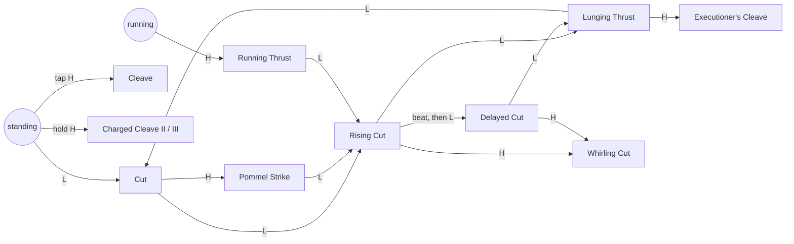

# The Way of the Guardsman: combat and progression plan

**Status:** built (M1 to M4), awaiting playtesting; where the build departs from this plan, Section 13 says so. **Scope:** Chapter I (four levels and the Captain). **Covers:** all four pillars, built in four milestones (Section 10).

## 0. Summary

Today a fight is two buttons: a three-cut light combo and one heavy cleave. The air slash, the plunge, the bash, the rolling cut and the knives each help only in particular moments. Yusuf gains one technique per level, makes no choices, and never grows stronger, so the player has nothing to look forward to and tires of the fighting.

This plan turns combat into a craft that grows and progression into a path the player chooses:

| Pillar | In one line |
| --- | --- |
| **1. The move set** | The light combo branches into enders on the heavy button. Add a delayed cut, a cleave charged in three levels and a running thrust: seven new attacks, each with a clear job. |
| **2. Resolve and Arts** | A meter (عزم, *Resolve*) filled by fighting well and spent on five Arts, the hero's great techniques: a whirlwind of cuts, a dash through a line of men, a naphtha flask, a second wind and the Judgment of the Guard. |
| **3. Honour, the tree and keepsakes** | A currency (شرف, *Honour*) earned by protecting people and fighting well. Spend it at lamps on a technique tree with three branches (Blade, Shield, Shadow). Eight keepsakes (passive relics) are given by the people Yusuf saves or found hidden; two or three can be worn at once. |
| **4. Growth you can see** | Something new every two to three minutes. Each unlock is taught by a hint and then by a fight that asks for it. A Techniques page lists every move. Soldiers grow tougher and answer the new moves, so the stronger hero still meets resistance. |

By the Last Gate the player commands **18 attacks and five Arts** (today: 11 attacks) and has made **about 14 choices** (today: none). Their Yusuf fights in a way they chose.

---

## 1. Goals and how we will know

| Goal | Measure (checked by tests, captures or a playtest) |
| --- | --- |
| Every fight offers several good answers | Each soldier kind has at least three effective answers (Section 4.5) |
| Fighting well is rewarded | Resolve fills from parries, enders and finishers; a fight fought well ends with an Art ready |
| Something new arrives often | Five or more unlocks per level (story, purchases, keepsakes), one every two to three minutes |
| The player makes choices | 15 tree nodes and 8 keepsakes; a thorough player affords about 65% of the tree by the Captain; respec is free |
| Growth is felt | With the starter kit alone a late swordsman takes about 40% longer to kill; with the kit the player has by then, about 20% less time than an early one did |
| Readability and fairness hold | Every enemy blow still glints in time; at most two attackers; every new move reads at 640×360 |

## 2. Where we are (audit)

Measured from `features/warrior/definitions/*.tres` and the hero's animation strips:

| Move | Startup | Whole move | Damage | Poise | Stamina | Notes |
| --- | --- | --- | --- | --- | --- | --- |
| Cut | 130 ms | 430 ms | 12 | 12 | 11 | Combo step 1 |
| Rising Cut | 120 ms | 420 ms | 13 | 12 | 11 | Step 2 |
| Lunging Thrust | 140 ms | 500 ms | 20 | 22 | 14 | Step 3, lunges 120 px/s |
| Cleave | 278 ms | 633 ms | 30 | 40 | 26 | Breaks guards |
| Air slash | 115 ms | 345 ms | 11 | 10 | 9 | Two a jump |
| Plunging strike | (a hang) | | 24 + 12 | 40 + 24 | 16 | Overwhelms; kills the unaware |
| Shield bash | 100 ms | 340 ms | 4 | 18 | 12 | Breaks any guard, overwhelms shield walls |
| Rolling cut | 50 ms | 340 ms | 14 | 16 | 10 | Late in a roll |
| Knives | 50 ms | 280 ms | 12 | 14 | | Three, refilled at lamps |
| Parry | | 400 ms | | | 6 | Window 0.17 s; riposte ×1.8 within 1.3 s |
| Roll | | 444 ms | | | 22 | Invulnerable for the first 0.3 s |
| Finishers | | | kill | | +40 back | Four, on a staggered soldier at half health |

**Progression today:** one technique per level (the bash, the knives, the plunge, the rolling cut), given by the story. No currency, no choices, no growth in strength.

**Rewards today:** manuscripts (lore) and captives saved (a number on the end screen).

**The core problem:** the combo is the same string from the first soldier to the Captain, and nothing ever changes it.

## 3. Fantasy and design rules

**Fantasy.** A guardsman of the Caliph begins as a survivor with a sabre and a shield. By the Last Gate he has become a master of the *furusiyya*, the Arabic arts of arms. He grows by protecting people, never by plundering.

**Rules.**

1. **Every move has a job.** No move duplicates another, and each answers a question some soldier asks.
2. **Choices, not just unlocks.** The story hands out signature moves; Honour buys the rest in the order the player chooses.
3. **Skill pays.** Parries, enders and finishers fill Resolve; being hit drains it.
4. **No pile of new buttons.** There is one new button (Art). Everything else uses buttons the player already knows, in context.
5. **The tone holds.** Honour comes from saving people and fighting well, never from loot. Every effect stays physical and grounded: no magic.

---

## 4. Pillar 1: the move set

### 4.1 Input grammar

| Context | Light (J / X) | Heavy (K / Y) |
| --- | --- | --- |
| Standing | Cut (combo step 1) | Cleave; **hold** to charge it |
| Running (for 0.2 s or more) | Cut | **Running Thrust** |
| After the Cut | Rising Cut | **Pommel Strike** |
| After the Rising Cut | Lunging Thrust | **Whirling Cut** |
| Within 0.4 s after the Rising Cut ends | **Delayed Cut** | Cleave |
| After the Lunging Thrust | Cut (the string loops) | **Executioner's Cleave** |
| After the Pommel Strike | Rising Cut (the string goes on) | Cleave |
| After the Delayed Cut | Lunging Thrust | Whirling Cut |
| In the air | Air slash | Plunge |
| Late in a roll | Rolling cut | Cleave |
| Block held | Cut out of the guard | Shield bash |
| A wounded, staggered soldier in reach | (as above) | Finisher |

**Buffering.** Presses are buffered for 0.16 s, as today.

**Enders.** An ender takes the heavy button's place only once it is learned. Until then, heavy after a light attack is the plain Cleave, as it is now.

**Charging costs no speed.** The Cleave's wind-up flows into the charge: if the button is still held when the blade is raised (about 0.13 s in), the wind-up holds there. A tap is the same Cleave the player knows, with no added delay.

### 4.2 The full move list

| Move | Input | Startup (target) | Damage | Poise | Stamina | Properties | Job | Comes from |
| --- | --- | --- | --- | --- | --- | --- | --- | --- |
| Cut | L | 130 ms | 12 | 12 | 11 | | Opener | Start |
| Rising Cut | L, L | 120 ms | 13 | 12 | 11 | | Chain | Start |
| Lunging Thrust | L, L, L | 140 ms | 20 | 22 | 14 | Lunges | Combo payoff | Start |
| Cleave | Tap H | 278 ms | 30 | 40 | 26 | Breaks guards | Guard breaker | Start |
| **Pommel Strike** | L → H | 90 ms | 6 | 26 | 9 | Breaks guards; short | Fast stun that extends the string | Tree, Blade 1 |
| **Whirling Cut** | L, L → H | 160 ms | 16 | 18 | 18 | Hits front **and** back; throws men outward | Crowds and ambushes | Tree, Blade 2 |
| **Delayed Cut** | L, L, (beat), L | 180 ms | 18 | 24 | 12 | Leads into the Lunging Thrust | Catches a guard as it drops | Tree, Blade 3 |
| **Executioner's Cleave** | L, L, L → H | 220 ms | 38 | 50 | 24 | Breaks guards; always severs (full gore) | Big finish to a full string | Tree, Blade 4 |
| **Charged Cleave II** | Hold H 0.9 s | 100 ms after release | 42 | 55 | 32 | Breaks shield walls (*overwhelms*); heavy knockback | Shield-bearers, mace-bearers | Story, Level 1 |
| **Charged Cleave III** | Hold H 1.5 s | 100 ms after release | 56 | 70 | 38 | Cannot be blocked; long stagger; men within 48 px flinch | Armour, groups, the Captain | Story, Level 1 |
| **Running Thrust** | Run, then H | 120 ms | 22 | 24 | 18 | Dashes 110 px; stops in the first man | Closes on spears, bows and pots | Tree, Shadow 4 |
| Air slash | L in the air | 115 ms | 11 | 10 | 9 | Two a jump | Air control | Start |
| Plunging strike | H in the air | (a hang) | 24 + 12 | 40 + 24 | 16 | Overwhelms | Death from above | Story, Level 3 |
| Shield bash | Block + H | 100 ms | 4 | 18 | 12 | Breaks any guard; overwhelms walls | Shield-bearers | Story, Level 2 |
| Rolling cut | Roll, then L | 50 ms | 14 | 16 | 10 | Turns on the man passed | Punish from behind | Story, Level 4 |
| Knives | U / LT | 50 ms | 12 | 14 | | Three (more with upgrades) | Range | Story, Level 2 |
| Parry and riposte | Block on the blow | | ×1.8 | | 6 | Window 0.17 s | Defence that pays | Start |
| Finishers | H on a soldier glowing red | | kill | | +40 back | Four scripted kills | Payoff | Start |

**Charging.** He stands his ground and can turn, but cannot move. A hit interrupts the charge (no armour) and a roll cancels it. That risk is the price of the power.

**Reading the charge.** The blade's glint grows as he charges, and a low hum rises. Each level is marked by a flash on the blade and a tone.

### 4.3 The new moves in detail

- **Pommel Strike.** He drives the sabre's pommel and the shield's rim into the man's face: a short hop forward, live for two frames.
  - Its poise damage adds to the Cut's, so Cut → Pommel staggers a swordsman (12 + 26 against his 26). Cut → Rising Cut (24) does not.
  - Against a raised guard it knocks the guard aside, like a small bash.
  - The Rising Cut follows it, so it extends the string instead of ending it.
- **Whirling Cut.** A full turn on the spot with the blade at chest height. The blade-sweep hitbox follows the blade round, so it covers both sides.
  - Men hit are thrown away from Yusuf on whichever side they stood (radial knockback).
  - It ends the string and leaves him open for a moment.
- **Delayed Cut.** A swordsman who sees a combo begin raises his guard and lowers it 0.85 s later (a veteran after 0.8 s).
  - If the player lets the Rising Cut finish and presses within 0.4 s, Yusuf makes a heavier diagonal cut that arrives as the guard drops. A further press gives the Lunging Thrust.
  - It rewards rhythm and answers soldiers who block.
- **Executioner's Cleave.** After the Lunging Thrust, a step-in and an overhead blow carried by the string's momentum. It is faster and harder than a standing Cleave, and it always severs. It is the reward for landing a full string.
- **Charged Cleave.** Hold the heavy button.
  - Level I is the Cleave the player already knows.
  - Level II breaks a shield-bearer's wall.
  - Level III is a two-handed blow that cannot be blocked and knocks a man reeling. The men beside him flinch for a moment.
  - Hamid teaches it at the very start of the chapter.
- **Running Thrust.** From a run, the heavy button drives the point forward in a long dash that stops in the first man. It reaches spearmen, archers and engineers.

### 4.4 The combo grammar

### 4.5 What answers what

| Soldier | Best answers (three or more) |
| --- | --- |
| Swordsman | Parry and riposte; Pommel Strike through his guard; Delayed Cut as his guard drops; finisher |
| Spearman | Running Thrust inside his reach; jump or roll his sweep; Whirling Cut when he is close |
| Archer | Knives; Running Thrust; a plunge from above; Piercing Line |
| Keshig veteran | Parry his first cut only, then his chained second; Delayed Cut; Charged Cleave II through his guard |
| Mace-bearer | Roll behind his smash and use the rolling cut; Charged Cleave II and III (poise); parry the smash |
| Georgian shield-bearer | Shield bash; Charged Cleave II (overwhelms); plunge; roll behind him |
| Siege engineer | Knives; Running Thrust; plunge; Naft Flask |
| Groups and ambushes | Whirling Cut; Charged Cleave III; Storm of Blades |
| Toqto Noyan | Parry between his chains; Charged Cleave II after his smash; Piercing Line; Second Wind |

### 4.6 Assets for Pillar 1

| Asset | Count | Notes |
| --- | --- | --- |
| Hero animations | 7 | `pommel_strike`, `whirling_cut`, `delayed_cut`, `executioner`, `charge_hold` (loop), `cleave_charged` (levels II and III), `running_thrust` |
| Attack definitions | 7 | Pommel, Whirling, Delayed, Executioner, Charged II and III, Running Thrust (Charge I is `heavy.tres`) |
| Effects | 3 | Charge glint in three intensities; the dust and grit of the level-III blow; the trail of the whirl (the runtime sword trail already follows the blade) |
| Sounds | 5 | Charge hum (rising), charge level tone, release boom, pommel crack, whirl whoosh |
| Hints and strings | about 12 | One hint per move (with the device's buttons), EN and AR |

### 4.7 Tests for Pillar 1

- Each move's input plays its animation, and the move hits where it should (the Whirling Cut also hits behind him).
- Each move's properties hold:
  - the Pommel Strike breaks a guard and continues into the Rising Cut;
  - the Delayed Cut fires only inside its window;
  - Charge II breaks a shield wall, and Charge III cannot be blocked;
  - the Running Thrust closes 110 px.
- A hit interrupts the charge and a roll cancels it.
- Before an ender is learned, heavy after a light attack is still the plain Cleave.
- The charge and the run are tested with real keyboard and pad input.
- The animations pass `tools/animation_lint.mjs`.

---

## 5. Pillar 2: Resolve and Arts

### 5.1 Resolve (عزم)

A meter under the stamina bar: 100 points in two segments of 50.

| Event | Resolve |
| --- | --- |
| A light attack lands | +3 |
| An ender, a charged cleave or a bash lands | +6 |
| A parry | +15 |
| A riposte lands | +6 |
| A finisher | +20 |
| A surprise kill or a plunge kill | +15 |
| Any other kill | +5 |
| A captive saved from a headsman | +25 |
| Yusuf is hit | −10 |
| No soldier fighting him for 8 s | Above 50, drains toward 50 at 4 a second |

**Between fights.** The first segment is kept, so an Art waits for the next fight; the second segment must be earned in the fight itself.

**Saving and dying.** Resolve is saved at lamps. On death the hero returns with what he had at the lamp.

**Pace.** A fight against three swordsmen, fought well, earns about 90 Resolve: one Art for every fight or two. Keepsakes and tree nodes can change the rates (Section 6).

### 5.2 Arts

| Art | Cost | What it does | Length | Comes from |
| --- | --- | --- | --- | --- |
| **Storm of Blades** (عاصفة السيوف) | 50 | Four cuts all round him (±56 px), each 10 damage and 10 poise, then a last wide cut that throws men back. Nothing staggers him while he turns. | 1.0 s | Story, Level 2: a page of the treatise |
| **Piercing Line** (الخط النافذ) | 50 | A 140 px dash through the enemy line. He cannot be hurt during it. Every man he passes is cut (20 damage, 30 poise, most stagger), and he ends behind them. | 0.5 s | Story, Level 3: a page of the treatise |
| **Naft Flask** (قارورة النفط) | 50 | Lobs a flask of the engineers' naphtha. It leaves burning ground for 3 s that burns through any shield and staggers each man on his first burn. It burns Yusuf too. | 0.4 s | Story, Level 3: taken from the first engineer he kills |
| **Second Wind** (النَّفَس الثاني) | 100 | He binds his wound and steels himself: 25 health and all his stamina back. For 10 s his attacks cost no stamina and light blows do not stagger him. | 0.7 s | Story, Level 4: Hamid, at the camp |
| **Judgment of the Guard** (حكم الحارس) | 100 | Finishes the nearest soldier within 60 px at once. A veteran, mace-bearer or shield-bearer above half health, or the Captain, takes one great blow instead (60 damage and a stagger). | cinematic | Tree, Blade capstone |

**Buttons.** The new **Art** button is **I** on the keyboard and **RT** on a pad (RT now duplicates heavy; heavy stays on Y). The second equipped Art is **O** on the keyboard, or **Block + Art** on either device. The player picks which two Arts to carry at a lamp.

**Rules.**

- No Art can start during a finisher, a hurt stagger or (except the Naft Flask) in the air.
- No Art ends the Captain early.
- The soldiers' fairness rules are unchanged.

### 5.3 The HUD

- The Resolve bar sits under stamina: amber, with a dark notch at half.
- A full segment flares once, and the icons of the equipped Arts light up beside the bar.
- When an Art is used, the bar drains with a bright trail.

### 5.4 Assets for Pillar 2

| Asset | Count | Notes |
| --- | --- | --- |
| Hero animations | 5 | `art_storm`, `art_pierce`, `art_naft`, `art_second_wind`, `art_judgment` (paired with each soldier's existing finisher halves) |
| Effects | 4 | Trail of the storm, dash streak with after-images, the flask in flight (reuses the fire pot and the burning ground, on the hero's side), a breath of dust and embers for the second wind |
| Sounds | 5 | One sting per Art |
| Icons | 5 | One per Art, for the HUD and the menus |

### 5.5 Tests for Pillar 2

- Resolve rises and falls correctly for each event, drains outside fights and is saved.
- Each Art has its effect:
  - the Storm hits both sides four times;
  - the Piercing Line passes through and cannot be hurt;
  - the Naft Flask burns through shields and burns the hero too;
  - Second Wind restores and protects;
  - Judgment finishes a common soldier and only strikes the Captain and elites above half health.
- Costs are charged and refusals work.
- The second Art fires on O and on Block + Art.

---

## 6. Pillar 3: Honour, the technique tree and keepsakes

### 6.1 Honour (شرف)

The guardsman grows by protecting people. Honour is earned, never looted.

| Source | Honour |
| --- | --- |
| A captive saved from a headsman | 30 |
| Someone freed from their captors (the mother and her son, the roped captives, Salim, the librarian) | 10 each |
| A manuscript rescued | 15 (a treatise page: 20) |
| A guardsman's token found (two hidden in each level: bronze badges of the Caliph's fallen guard) | 25 |
| A soldier killed | 4 |
| ... by a finisher, a surprise strike or a plunge | +4 |
| ... by a riposte or an Art | +2 |
| A level completed | 40 |

**On death, Honour is kept.** The game punishes recklessness with lost ground, not lost growth.

### 6.2 The budget

Worked out from the real contents of each level: soldiers, pages, captives and people.

| Source | Fallen Market | Streets of Ash | Scholars' Quarter | Last Gate |
| --- | --- | --- | --- | --- |
| People | 50 (the gate captive; the mother and her son) | 90 (two headsmen; two roped captives and Salim) | 70 (two headsmen; the librarian) | 80 (two headsmen; two captives) |
| Pages | 45 (3) | 70 (2 manuscripts, 2 treatise pages) | 85 (3 manuscripts, 2 treatise pages) | 50 (2 manuscripts, 1 treatise page) |
| Tokens | 50 | 50 | 50 | 50 |
| Soldiers | about 80 (13) | about 95 (15) | about 105 (16) | about 85 (13) |
| Level completed | 40 | 40 | 40 | (carried into Chapter II) |
| **Total, thorough player** | **about 265** | **about 345** | **about 350** | **about 265** |

- **A thorough player** earns about 1,200 Honour before the Captain, against a tree that costs 1,740 in all: about 65% of it.
- **A quick player** (no tokens, fewer skilled kills, some captives lost) earns about 850: about 50%.
- The first lamp of the Fallen Market (column 79) comes after about 75 Honour, enough for the first purchase about four minutes into the game.

### 6.3 The lamp

**Lighting or resting at a lamp** rests and saves as today. It then opens the **lamp menu**:

- **Techniques:** the tree (Section 6.4). Buy nodes and read what each does. **Respec is free.**
- **Keepsakes and Arts:** wear two keepsakes (three after the Shield capstone) and choose the two Arts to carry.
- **Leave.**

### 6.4 The technique tree

Three branches of five nodes each. A node needs the one before it in its branch, and some also need a story moment ("Needs").

**Blade (السيف): offence**

| # | Node | Cost | Effect | Needs |
| --- | --- | --- | --- | --- |
| 1 | Pommel Strike | 60 | Ender after the Cut | |
| 2 | Whirling Cut | 90 | Ender after the Rising Cut | |
| 3 | Delayed Cut | 90 | The beat-timed third cut | |
| 4 | Executioner's Cleave | 140 | Ender after the Lunging Thrust | Reached the Scholars' Quarter |
| 5 | Judgment of the Guard | 200 | Art (Section 5.2) | Reached the Last Gate |

**Shield (الترس): defence**

| # | Node | Cost | Effect | Needs |
| --- | --- | --- | --- | --- |
| 1 | Steady Guard | 60 | Blocked blows cost 30% less stamina | |
| 2 | Riposte Mastery | 90 | Parry window +0.04 s (to 0.21 s); ripostes ×2.2 | |
| 3 | Bash Mastery | 90 | The bash costs half, and staggers a man who is not guarding | Knows the bash (Level 2) |
| 4 | Iron Will | 140 | Hurt and guard-break staggers 35% shorter | |
| 5 | Wall of the Caliph | 200 | A parry restores 15 stamina and 10 Resolve; a third keepsake slot | |

**Shadow (الظل): stealth, reach and range**

| # | Node | Cost | Effect | Needs |
| --- | --- | --- | --- | --- |
| 1 | Quiet Step | 60 | Busy soldiers hear him 40% less, and stay startled 0.2 s longer | |
| 2 | Bandolier | 90 | Two more knives | Has the knives (Level 2) |
| 3 | Death from Above | 90 | Plunge damage +50%; its landing reaches twice as far | Knows the plunge (Level 3) |
| 4 | Running Thrust | 140 | Run, then heavy | |
| 5 | Unseen | 200 | Surprise and plunge kills restore 10 health and 20 Resolve | |

### 6.5 What the story teaches

| Level | Unlock | Given by |
| --- | --- | --- |
| Fallen Market | **Charged Cleave** (levels II and III) | Hamid, the wounded guard, at the start ("hold your blow until your arm is full"). If the player walks past him, a hint before the first fight teaches it anyway. |
| Fallen Market | **Honour and the lamp menu** | The first lamp |
| Streets of Ash | Shield bash | A treatise page (as now) |
| Streets of Ash | Throwing knives | Salim (as now) |
| Streets of Ash | **Resolve and the Storm of Blades** | A treatise page. The meter appears half full, and the next fight (a group) asks for the Art. |
| Scholars' Quarter | Plunging strike | A treatise page (as now) |
| Scholars' Quarter | **Naft Flask** | The first engineer he kills drops his flasks |
| Scholars' Quarter | **Piercing Line** | A treatise page |
| Last Gate | Rolling cut | A treatise page (as now) |
| Last Gate | **Second Wind** | Hamid, waiting at the camp |

**Each level also adds** about 2 to 3 purchases (more in later levels) and 2 keepsakes (Section 6.6).

### 6.6 Keepsakes

Two slots, or three with Wall of the Caliph. Each keepsake belongs to someone in the story or lies hidden. Each changes how the hero plays rather than adding a flat number.

| Keepsake | Effect | Where |
| --- | --- | --- |
| **The Mother's Red Thread** | Remedies heal 15 more | Fallen Market: the mother, once her son is safe |
| **Ibrahim's Reed Pen** | Pages give double Honour | Fallen Market: Ibrahim, after the ambush |
| **Salim's Saffron Sash** | One more knife; a kill with a knife returns it | Streets of Ash: Salim, with the knives |
| **Bronze Seal of the Guard** | A parry restores 10 stamina | Streets of Ash: hidden on the rooftops |
| **The Librarian's Ink-stone** | Staggered soldiers stay staggered 25% longer (more finishers) | Scholars' Quarter: the librarian |
| **Prayer Beads** (misbaha) | Finishers heal 12 | Scholars' Quarter: the fountain captive gives them if he lives; if he dies, they lie beside him |
| **A Fallen Guardsman's Bracer** | Below 30% health, damage +20% | Last Gate: hidden on the rampart, by a dead guardsman |
| **Ash-black Ribbon** | Resolve fills 30% faster, but he takes 10% more damage | Last Gate: hidden in the siege camp |

### 6.7 Secrets

Each level gains two hidden guardsman's tokens and, in the later levels, the hidden keepsakes. They sit where the level already invites a detour: rooftops, galleries reached by dropping through planks, the far end of a gallery, the top of a siege wagon. A faint bronze glint marks them, like the manuscripts.

### 6.8 Save data

- **New fields in `SaveGame`:**
  - `honour: int`;
  - `bought: Array[StringName]` (tree nodes);
  - `keepsakes: Array[StringName]` (owned);
  - `worn: Array[StringName]` (worn);
  - `arts: Array[StringName]` (carried);
  - `resolve: float`;
  - `tokens: Array[StringName]` (found).
- **Older saves** load with no Honour. Their story techniques still come from the level data and the `knows_<t>` flags, so nothing is lost.

### 6.9 Tests for Pillar 3

- **Honour:** each source pays the right amount, and an autoplayed thorough run of each level earns its budget.
- **Buying:** a purchase charges its cost and checks its prerequisites and story gates; refusals and respec work.
- **Effects:** each node and each keepsake does what it says; the slot limits hold.
- **Saving:** all of it saves and loads.
- **The lamp menu:** it opens, buys and closes through the real session with real input.

---

## 7. Pillar 4: growth you can see, pacing and balance

### 7.1 The unlock schedule

Each level takes about 12 to 15 minutes. Key: ★ story unlock, ◆ likely purchase, ♦ keepsake.

| Level | Unlocks | Count |
| --- | --- | --- |
| Fallen Market | ★ Charged Cleave (start) ★ Honour and the lamp menu (first lamp) ◆ Pommel Strike, Steady Guard or Quiet Step ◆ a second node ♦ Red Thread ♦ Reed Pen | 6 |
| Streets of Ash | ★ shield bash ★ knives ★ Resolve and the Storm of Blades ◆ two or three nodes (Whirling Cut, Riposte Mastery, Bandolier...) ♦ Saffron Sash ♦ Bronze Seal | 8 |
| Scholars' Quarter | ★ plunge ★ Naft Flask ★ Piercing Line ◆ three nodes (Executioner's Cleave, Death from Above...) ♦ Ink-stone ♦ Prayer Beads | 8 |
| Last Gate | ★ rolling cut ★ Second Wind ◆ two or three nodes, perhaps a capstone ♦ Guardsman's Bracer ♦ Ash-black Ribbon +10 health | 7 |

**Health.** Yusuf's health also grows by 10 at the end of each level (100 → 130 by the Last Gate). The story card between levels says so.

### 7.2 Teaching each unlock

Every unlock follows the same beat:

1. A notice: "Technique learned: ...".
2. A one-line hint with the buttons for the device in use, once play resumes.
3. Within a minute, a **proving fight** that asks for it.

For example, a blocking swordsman follows the Pommel Strike, a crowd follows the Whirling Cut and a shield-bearer follows Charged Cleave II. For a move the player buys, the next suitable fight is marked in the level data.

### 7.3 The Techniques page

The pause menu gains **Techniques**:

- every move the hero knows, with its buttons for the device in use and the move's animation looping beside it;
- the Arts and keepsakes he carries, and the Honour he holds;
- moves not yet known, listed as locked with where they come from, so the player sees what lies ahead.

The same list appears in the lamp menu.

### 7.4 Tougher soldiers

| | Fallen Market | Streets of Ash | Scholars' Quarter | Last Gate |
| --- | --- | --- | --- | --- |
| Common soldiers' health | ×1.0 | ×1.1 | ×1.2 | ×1.3 |
| Poise | ×1.0 | ×1.0 | ×1.1 | ×1.2 |
| Mixed groups | Rare | Some | Most fights | Most fights |
| Elite soldiers (veterans, mace-bearers, shield-bearers) | 0 | 2 | 3 | 3 or 4 |

**The Captain** goes from 420 to about 520 health so he lasts against the late kit. The Storm's light cuts do not stagger him.

### 7.5 Soldiers who answer back

The new moves must not become one answer that wins every fight. Soldiers learn to read them:

- **Against a charge:** a veteran steps back from a charge he sees building, and a spearman thrusts into it (the charge has no armour).
- **Against a spammed whirl:** a soldier caught by the whirl twice in a fight hangs back out of its reach.
- **Against the Running Thrust:** an archer who sees it coming rolls aside if he can, and a shield-bearer simply takes it on his shield.
- **Against Arts:** groups spread out after an Art. The Captain braces against the Piercing Line (he is pushed, not cut through).

These are small rules in the brains, tested like the rest.

### 7.6 Balance dials

All in data, so balance can be tuned without code:

- soldiers' health and poise multipliers per level;
- attack cooldowns;
- Resolve gains and costs;
- Honour amounts and node costs;
- keepsake strengths;
- the charge thresholds;
- the Delayed Cut window.

**Time-to-kill tests** measure a scripted player with the starter kit and with each level's expected kit, against each soldier kind in each level.

### 7.7 Feedback

Each unlock and reward gets its own sound and flash:

- distinct sounds and flashes for each ender;
- a charge hum that rises through its levels;
- a sting for each Art;
- a soft chime and a gold flicker on the Honour count when it grows;
- a short notice for every unlock, keepsake and token.

---

## 8. Technical design

### 8.1 New data (read-only resources)

| Resource | Fields |
| --- | --- |
| `TechniqueDefinition` | id; branch; tier; cost; requires (ids); requires_flag (story); name and description keys; icon; kind (move, passive, art); modifiers |
| `ArtDefinition` | id; cost; animation; attack (an `AttackDefinition`) or a handler name; icon; name and description keys |
| `KeepsakeDefinition` | id; name and description keys; icon; modifiers |
| `Modifiers` | multipliers and switches the hero and the session read, for example: block cost; parry window; riposte multiplier; knife capacity; plunge damage and landing reach; remedy heal; hurt and guard-break time; Resolve gain; damage taken; parry restores stamina or Resolve; finishers heal; stagger length on soldiers; damage at low health |

The hero's working numbers are the profile's numbers passed through the active `Modifiers` (bought nodes plus worn keepsakes). They are recomputed whenever either changes.

### 8.2 The hero (`Warrior`)

**New moves as techniques.** Every new move is a technique, like the bash today, checked with `knows()`. The tree and the story both add to the same list, so M1 can ship the moves (unlocked by level data for testing) before M3 makes them purchases.

**Enders.** A table maps each combo step to its ender. It is consulted where heavy currently cancels into the Cleave (`_attacking`, after `recovery_from`).

**The Delayed Cut.** The time since the Rising Cut ended; a light press inside the window takes the delayed branch.

**The charge.**

- `WarriorInput` adds `heavy_held`.
- A `CHARGE` state holds the Cleave's wind-up frame and counts toward 0.9 s and 1.5 s.
- Releasing starts the matching attack; a hit interrupts the charge and a roll cancels it.

**The Running Thrust.** Heavy while running (above walking speed for 0.2 s), once known.

**Radial knockback.** `AttackDefinition.radial` throws a man away from the hero on either side (Whirling Cut, Storm of Blades, the flinch of Charge III).

**Resolve.**

- A value on the hero with a `resolve_changed` signal.
- It rises from his own hits, parries, ripostes and finishers.
- The session adds kills and saves.

**Arts.** An `ART` state:

- **Storm:** several hit windows, and nothing staggers him.
- **Piercing Line:** an invulnerable dash that hits everyone it passes once.
- **Naft:** a projectile on the hero's side that reuses `FirePot` and `BurningGround` with the teams swapped.
- **Second Wind:** a timed effect on the hero.
- **Judgment:** a finisher on demand, through the existing finisher system.

### 8.3 The session (`AbbasidGame`)

- **Honour accounting** from signals it already receives (deaths with the killing blow, captives saved, people freed, pages, the level's end), plus the new tokens.
- **The lamp menu:** purchases, respec, wearing and carrying, saving. Modifiers are applied on entering a level and after every change.
- **Story gifts** of every kind (a technique, an Art, a keepsake), through the existing `teaches` fields on pages and people, plus an engineer's flask that drops when he dies.

### 8.4 The interface

- **HUD:** the Resolve bar and the Art icons; the Honour count beside the pages.
- **Menus:** `LampMenu` (Techniques, Keepsakes and Arts, Leave), the tree screen, and the Techniques page in the pause menu. All are built on `MenuScreen` and work with keyboard, pad and mouse.
- **Strings:** every name, description, notice and hint in English and Arabic.

### 8.5 Level data (`tools/levels/<level>.mjs`)

Per level:

- tokens and hidden keepsakes (positions);
- keepsakes given by people (`Npc.gives_keepsake`, including the captive's beads);
- proving-fight markers;
- the story gifts;
- the soldier multipliers of Section 7.4.

### 8.6 Asset generation

| Kind | Count | Generator |
| --- | --- | --- |
| Hero animations | 12 | `characters/yusuf_animations.mjs` |
| Soldier halves for the Judgment | Reuse the finisher halves | `characters/mongol3d_animations.mjs` |
| Effects | About 7 | `build_effects.mjs` |
| Sounds | About 10 | `audio/build_sounds.mjs` |
| Icons | About 28 (15 nodes, 8 keepsakes, 5 Arts) | The UI art generator |
| Pickups (token, keepsake, the dropped flask) | 3 sprites | `build_effects.mjs` |

### 8.7 Testing

Each milestone:

- adds its gameplay, enemy and session checks (Sections 4.7, 5.5 and 6.9);
- keeps the traversal autoplayer finishing all four levels;
- adds captures for review: every new move and Art, the lamp menu, the tree and the Techniques page;
- keeps `node tools/animation_lint.mjs` clean for the new animations.

---

## 9. Order of work inside each milestone

1. **Data and rules:** definitions, hero states and session logic, with tests written alongside.
2. **Animations:** generated, linted, and reviewed in the art review sheets and the reel.
3. **Presentation:** effects, sounds, HUD and hints.
4. **Level data:** placement, proving fights and the unlock beats.
5. **Review:** captures through the real game view, the full suite, then `PROGRESS.md`, `AGENTS.md` and the README.

## 10. Milestones

| Milestone | Delivers | Done when |
| --- | --- | --- |
| **M1: The move set** | The four enders, the Delayed Cut, Charged Cleave II and III, the Running Thrust; their animations, effects, sounds and hints; Hamid teaches the charge | Every move's tests pass with real input; captures reviewed; lint clean; the full suite green |
| **M2: Resolve and Arts** | The meter and its rules, the Art buttons, five Arts, the HUD, the story gifts (Storm, Piercing Line, Naft Flask, Second Wind) | Resolve and Art tests pass; captures of each Art reviewed; the full suite green |
| **M3: Honour, the tree and keepsakes** | Honour and its sources, tokens and keepsakes placed, the lamp menu, the tree with purchases and respec, wearing keepsakes and carrying Arts, saving all of it; the M1 moves become purchases | Purchases, effects and saves tested through the real session; menu captures reviewed; the full suite green |
| **M4: Pacing and balance** | The unlock schedule and proving fights in all four levels, tougher soldiers and their answers, the Techniques page, the feedback polish, health growth, time-to-kill tests, a capture of a full play-through | The time-to-kill and schedule checks pass; docs and README updated; the full suite green |

Each milestone ends with the art reviewed in captures, `PROGRESS.md` and `AGENTS.md` updated and, when the user asks, a commit pushed to GitHub.

## 11. Risks

| Risk | Answer |
| --- | --- |
| Too many inputs to remember | One new button; the rest is context on known buttons; enders come one at a time; the Techniques page lists every move with the player's own buttons |
| The hero becomes too strong | Tougher soldiers (in data); soldiers who answer the new moves; the budget buys about 65% of the tree; time-to-kill tests per level |
| Holding a button is hard for some players | A setting makes the charge a toggle; full input rebinding is already planned for release |
| Twelve new hero animations | Built in the 3D pipeline from the existing poses, one milestone at a time, linted and reviewed |
| Effects crowd the screen | The style guide's rules for effects; one strong colour per Art; review at 640×360 |
| A tree menu that confuses | Three short columns with costs, clear locked states and one line of description, not a web |
| Older saves | Defaults keep them playable; story techniques still come from the level data |

## 12. Decisions (defaults chosen; any can change)

1. **Honour is kept on death.**
2. **Respec is free at any lamp,** so the player can experiment.
3. **The story teaches the signature moves**; Honour buys the rest.
4. **The Art buttons:** the Art button is I on the keyboard and RT on a pad (heavy stays on Y). The second Art is O, or Block + Art.
5. **Keepsakes come from the people Yusuf saves** wherever possible (the mother, Ibrahim, Salim, the librarian, the fountain captive), so protecting people is also how the hero grows.
6. **The order of work is M1 → M2 → M3 → M4.** Each milestone is playable on its own.

## 13. As built

Where the build departs from the plan above:

- **Tougher soldiers:** health ×1.0 / 1.1 / 1.2 / 1.3 and poise ×1.0 / 1.0 / 1.1 / 1.2 (the plan had ×1.4 health at the Last Gate). Measured by the time-to-kill test: a scripted player who knows the string kills an early swordsman in 70 frames, a Last Gate one in 84 with the starting kit and in 62 with the executioner's cleave. At ×1.4 the grown kit could not beat the early time.
- **Honour amounts** are as in Section 6.1, held in `features/progression/catalog.tres` with the node prices.
- **Elite counts per level** were not changed: the levels keep the soldiers they had.
- **Proving fights** are placement, not markers: each unlock comes just before a fight that calls for it (the Storm before the captors, the Piercing Line before the hall's line of men, the charge before the river gate's locked shields). A move bought at a lamp is taught by a hint as he rises.
- **The charge toggle** is a setting (Settings, Charged Cleave): one press begins it, the next strikes; two quick presses are the plain cleave.
